BAP treated hESC (day 8) snRNAseq data analyses
================
Arun Seetharam
3/24/2021

-   [1 snRNAseq data analyses](#snrnaseq-data-analyses)
    -   [1.1 Prerequisites](#prerequisites)
    -   [1.2 Importing 10x Datasets](#importing-10x-datasets)
    -   [1.3 Data quality insepction](#data-quality-insepction)
        -   [1.3.1 MT ratio in nucleus](#mt-ratio-in-nucleus)
        -   [1.3.2 Number of nuclei per
            sample](#number-of-nuclei-per-sample)
        -   [1.3.3 Density of nuclei per
            sample](#density-of-nuclei-per-sample)
        -   [1.3.4 Nubmer of Nuclei
            vs. genes](#nubmer-of-nuclei-vs-genes)
        -   [1.3.5 Nubmer of Nuclei
            vs. genes](#nubmer-of-nuclei-vs-genes-1)
        -   [1.3.6 Nubmer of Nuclei
            vs. genes](#nubmer-of-nuclei-vs-genes-2)
    -   [1.4 Data filtering](#data-filtering)
        -   [1.4.1 set up the metadata file and
            organize](#set-up-the-metadata-file-and-organize)
        -   [1.4.2 set up the metadata file and
            organize](#set-up-the-metadata-file-and-organize-1)
        -   [1.4.3 Before filtering](#before-filtering)
        -   [1.4.4 Preliminary filtering](#preliminary-filtering)
        -   [1.4.5 Final filtering](#final-filtering)
        -   [1.4.6 Removing ribosomal and MT
            proteins](#removing-ribosomal-and-mt-proteins)
    -   [1.5 Data integration and
        Clustering](#data-integration-and-clustering)
        -   [1.5.1 data integration](#data-integration)
        -   [1.5.2 Seurat](#seurat)
        -   [1.5.3 renumber the clusters](#renumber-the-clusters)
        -   [1.5.4 dimplots (colored based on
            clusters)](#dimplots-colored-based-on-clusters)
        -   [1.5.5 dimplots (colored based on
            conditions)](#dimplots-colored-based-on-conditions)
        -   [1.5.6 dimplots (colored based on
            samples)](#dimplots-colored-based-on-samples)
    -   [1.6 Find markers](#find-markers)
        -   [1.6.1 Check the number of
            markers](#check-the-number-of-markers)
    -   [1.7 Marker plots](#marker-plots)
        -   [1.7.1 Markers of cluster 1](#markers-of-cluster-1)
        -   [1.7.2 Markers of cluster 2](#markers-of-cluster-2)
        -   [1.7.3 Markers of cluster 3](#markers-of-cluster-3)
        -   [1.7.4 Markers of cluster 4](#markers-of-cluster-4)
        -   [1.7.5 Markers of cluster 5](#markers-of-cluster-5)
        -   [1.7.6 Markers of cluster 6](#markers-of-cluster-6)
        -   [1.7.7 Markers of cluster 7](#markers-of-cluster-7)
        -   [1.7.8 Markers of cluster 8](#markers-of-cluster-8)
        -   [1.7.9 Markers of cluster 9](#markers-of-cluster-9)
    -   [1.8 Run PlacentaCellEnrich on
        markers](#run-placentacellenrich-on-markers)
        -   [1.8.1 PCE for cluster 1
            markers](#pce-for-cluster-1-markers)
        -   [1.8.2 PCE for cluster 2
            markers](#pce-for-cluster-2-markers)
        -   [1.8.3 PCE for cluster 3
            markers](#pce-for-cluster-3-markers)
        -   [1.8.4 PCE for cluster 4
            markers](#pce-for-cluster-4-markers)
        -   [1.8.5 PCE for cluster 5
            markers](#pce-for-cluster-5-markers)
        -   [1.8.6 PCE for cluster 6
            markers](#pce-for-cluster-6-markers)
        -   [1.8.7 PCE for cluster 7
            markers](#pce-for-cluster-7-markers)
        -   [1.8.8 PCE for cluster 8
            markers](#pce-for-cluster-8-markers)
        -   [1.8.9 PCE for cluster 9
            markers](#pce-for-cluster-9-markers)
    -   [1.9 Plotting functions](#plotting-functions)
        -   [1.9.1 Find all Markers](#find-all-markers)
        -   [1.9.2 Find Conserved markers](#find-conserved-markers)
        -   [1.9.3 Expression tables](#expression-tables)
        -   [1.9.4 Cell numbers per
            clusters](#cell-numbers-per-clusters)
    -   [1.10 DE between conditions](#de-between-conditions)
        -   [1.10.1 Volcano Plot function](#volcano-plot-function)
        -   [1.10.2 Volcano plot for cluster
            1](#volcano-plot-for-cluster-1)
        -   [1.10.3 Volcano plot for cluster
            2](#volcano-plot-for-cluster-2)
        -   [1.10.4 Volcano plot for cluster
            3](#volcano-plot-for-cluster-3)
    -   [1.11 Figures for publication](#figures-for-publication)
        -   [1.11.1 Figure 3](#figure-3)
        -   [1.11.2 Figure 5](#figure-5)
        -   [1.11.3 Figure S4](#figure-s4)
        -   [1.11.4 Figure S5](#figure-s5)
    -   [1.12 Save Cerebro Image](#save-cerebro-image)
    -   [1.13 Save RDS file](#save-rds-file)
    -   [1.14 Session Info](#session-info)

# 1 snRNAseq data analyses

## 1.1 Prerequisites

This experiment has 2 conditions (BAP treated hESC exposed to 20% oxygen
and 5% oxygen), with 2 replicates each. The details are provided in the
manuscript. The packages that are needed for the analyses were loaded as
below. If you need the version information, session information is
printed at the bottom of this wiki.

``` r
setwd("~/TutejaLab/snn-results_20210308_testing-installation")
# load the modules
library(Seurat)
library(SeuratWrappers)
#> 
#> Attaching package: 'SeuratWrappers'
#> The following objects are masked from 'package:Seurat':
#> 
#>     ALRAChooseKPlot, ReadAlevin, RunALRA
library(knitr)
library(kableExtra)
library(ggplot2)
library(cowplot)
library(patchwork)
#> 
#> Attaching package: 'patchwork'
#> The following object is masked from 'package:cowplot':
#> 
#>     align_plots
library(metap)
library(multtest)
#> Loading required package: BiocGenerics
#> Loading required package: parallel
#> 
#> Attaching package: 'BiocGenerics'
#> The following objects are masked from 'package:parallel':
#> 
#>     clusterApply, clusterApplyLB, clusterCall, clusterEvalQ,
#>     clusterExport, clusterMap, parApply, parCapply, parLapply,
#>     parLapplyLB, parRapply, parSapply, parSapplyLB
#> The following objects are masked from 'package:stats':
#> 
#>     IQR, mad, sd, var, xtabs
#> The following objects are masked from 'package:base':
#> 
#>     anyDuplicated, append, as.data.frame, basename, cbind, colnames,
#>     dirname, do.call, duplicated, eval, evalq, Filter, Find, get, grep,
#>     grepl, intersect, is.unsorted, lapply, Map, mapply, match, mget,
#>     order, paste, pmax, pmax.int, pmin, pmin.int, Position, rank,
#>     rbind, Reduce, rownames, sapply, setdiff, sort, table, tapply,
#>     union, unique, unsplit, which.max, which.min
#> Loading required package: Biobase
#> Welcome to Bioconductor
#> 
#>     Vignettes contain introductory material; view with
#>     'browseVignettes()'. To cite Bioconductor, see
#>     'citation("Biobase")', and for packages 'citation("pkgname")'.
library(gridExtra)
#> 
#> Attaching package: 'gridExtra'
#> The following object is masked from 'package:Biobase':
#> 
#>     combine
#> The following object is masked from 'package:BiocGenerics':
#> 
#>     combine
library(dplyr)
#> 
#> Attaching package: 'dplyr'
#> The following object is masked from 'package:gridExtra':
#> 
#>     combine
#> The following object is masked from 'package:Biobase':
#> 
#>     combine
#> The following objects are masked from 'package:BiocGenerics':
#> 
#>     combine, intersect, setdiff, union
#> The following object is masked from 'package:kableExtra':
#> 
#>     group_rows
#> The following objects are masked from 'package:stats':
#> 
#>     filter, lag
#> The following objects are masked from 'package:base':
#> 
#>     intersect, setdiff, setequal, union
library(stringr)
library(TissueEnrich)
#> Loading required package: ensurer
#> Loading required package: tidyr
#> Loading required package: SummarizedExperiment
#> Loading required package: MatrixGenerics
#> Loading required package: matrixStats
#> 
#> Attaching package: 'matrixStats'
#> The following object is masked from 'package:dplyr':
#> 
#>     count
#> The following objects are masked from 'package:Biobase':
#> 
#>     anyMissing, rowMedians
#> 
#> Attaching package: 'MatrixGenerics'
#> The following objects are masked from 'package:matrixStats':
#> 
#>     colAlls, colAnyNAs, colAnys, colAvgsPerRowSet, colCollapse,
#>     colCounts, colCummaxs, colCummins, colCumprods, colCumsums,
#>     colDiffs, colIQRDiffs, colIQRs, colLogSumExps, colMadDiffs,
#>     colMads, colMaxs, colMeans2, colMedians, colMins, colOrderStats,
#>     colProds, colQuantiles, colRanges, colRanks, colSdDiffs, colSds,
#>     colSums2, colTabulates, colVarDiffs, colVars, colWeightedMads,
#>     colWeightedMeans, colWeightedMedians, colWeightedSds,
#>     colWeightedVars, rowAlls, rowAnyNAs, rowAnys, rowAvgsPerColSet,
#>     rowCollapse, rowCounts, rowCummaxs, rowCummins, rowCumprods,
#>     rowCumsums, rowDiffs, rowIQRDiffs, rowIQRs, rowLogSumExps,
#>     rowMadDiffs, rowMads, rowMaxs, rowMeans2, rowMedians, rowMins,
#>     rowOrderStats, rowProds, rowQuantiles, rowRanges, rowRanks,
#>     rowSdDiffs, rowSds, rowSums2, rowTabulates, rowVarDiffs, rowVars,
#>     rowWeightedMads, rowWeightedMeans, rowWeightedMedians,
#>     rowWeightedSds, rowWeightedVars
#> The following object is masked from 'package:Biobase':
#> 
#>     rowMedians
#> Loading required package: GenomicRanges
#> Loading required package: stats4
#> Loading required package: S4Vectors
#> 
#> Attaching package: 'S4Vectors'
#> The following object is masked from 'package:tidyr':
#> 
#>     expand
#> The following objects are masked from 'package:dplyr':
#> 
#>     first, rename
#> The following object is masked from 'package:base':
#> 
#>     expand.grid
#> Loading required package: IRanges
#> 
#> Attaching package: 'IRanges'
#> The following objects are masked from 'package:dplyr':
#> 
#>     collapse, desc, slice
#> The following object is masked from 'package:grDevices':
#> 
#>     windows
#> Loading required package: GenomeInfoDb
#> 
#> Attaching package: 'SummarizedExperiment'
#> The following object is masked from 'package:Seurat':
#> 
#>     Assays
#> Loading required package: GSEABase
#> Loading required package: annotate
#> Loading required package: AnnotationDbi
#> 
#> Attaching package: 'AnnotationDbi'
#> The following object is masked from 'package:dplyr':
#> 
#>     select
#> Loading required package: XML
#> Loading required package: graph
#> 
#> Attaching package: 'graph'
#> The following object is masked from 'package:XML':
#> 
#>     addNode
#> The following object is masked from 'package:stringr':
#> 
#>     boundary
library(gprofiler2)
library(tidyverse)
#> Registered S3 method overwritten by 'cli':
#>   method     from    
#>   print.boxx spatstat
#> -- Attaching packages --------------------------------------- tidyverse 1.3.0 --
#> v tibble  3.0.4     v purrr   0.3.4
#> v readr   1.4.0     v forcats 0.5.1
#> -- Conflicts ------------------------------------------ tidyverse_conflicts() --
#> x graph::boundary()        masks stringr::boundary()
#> x IRanges::collapse()      masks dplyr::collapse()
#> x dplyr::combine()         masks gridExtra::combine(), Biobase::combine(), BiocGenerics::combine()
#> x matrixStats::count()     masks dplyr::count()
#> x IRanges::desc()          masks dplyr::desc()
#> x S4Vectors::expand()      masks tidyr::expand()
#> x dplyr::filter()          masks stats::filter()
#> x S4Vectors::first()       masks dplyr::first()
#> x dplyr::group_rows()      masks kableExtra::group_rows()
#> x dplyr::lag()             masks stats::lag()
#> x BiocGenerics::Position() masks ggplot2::Position(), base::Position()
#> x purrr::reduce()          masks GenomicRanges::reduce(), IRanges::reduce()
#> x S4Vectors::rename()      masks dplyr::rename()
#> x AnnotationDbi::select()  masks dplyr::select()
#> x IRanges::slice()         masks dplyr::slice()
library(enhancedDimPlot)
library(calibrate)
#> Loading required package: MASS
#> 
#> Attaching package: 'MASS'
#> The following object is masked from 'package:AnnotationDbi':
#> 
#>     select
#> The following object is masked from 'package:dplyr':
#> 
#>     select
#> The following object is masked from 'package:patchwork':
#> 
#>     area
library(ggrepel)
library(dittoSeq)
library(ComplexHeatmap)
#> Loading required package: grid
#> ========================================
#> ComplexHeatmap version 2.6.2
#> Bioconductor page: http://bioconductor.org/packages/ComplexHeatmap/
#> Github page: https://github.com/jokergoo/ComplexHeatmap
#> Documentation: http://jokergoo.github.io/ComplexHeatmap-reference
#> 
#> If you use it in published research, please cite:
#> Gu, Z. Complex heatmaps reveal patterns and correlations in multidimensional 
#>   genomic data. Bioinformatics 2016.
#> 
#> This message can be suppressed by:
#>   suppressPackageStartupMessages(library(ComplexHeatmap))
#> ========================================
library(scales)
#> 
#> Attaching package: 'scales'
#> The following object is masked from 'package:purrr':
#> 
#>     discard
#> The following object is masked from 'package:readr':
#> 
#>     col_factor
library(ggvenn)
library(plotly)
#> 
#> Attaching package: 'plotly'
#> The following object is masked from 'package:ComplexHeatmap':
#> 
#>     add_heatmap
#> The following object is masked from 'package:MASS':
#> 
#>     select
#> The following object is masked from 'package:AnnotationDbi':
#> 
#>     select
#> The following object is masked from 'package:IRanges':
#> 
#>     slice
#> The following object is masked from 'package:S4Vectors':
#> 
#>     rename
#> The following object is masked from 'package:ggplot2':
#> 
#>     last_plot
#> The following object is masked from 'package:stats':
#> 
#>     filter
#> The following object is masked from 'package:graphics':
#> 
#>     layout
library(DT)
#> 
#> Attaching package: 'DT'
#> The following object is masked from 'package:Seurat':
#> 
#>     JS
library(cerebroApp)
#> This version of bslib is designed to work with shiny version 1.5.0.9007 or higher.
library(ape)
#> 
#> Attaching package: 'ape'
#> The following objects are masked from 'package:graph':
#> 
#>     complement, edges
library(enrichR)
#> Welcome to enrichR
#> Checking connection ...
#> Enrichr ... Connection is Live!
#> FlyEnrichr ... Connection is available!
#> WormEnrichr ... Connection is available!
#> YeastEnrichr ... Connection is available!
#> FishEnrichr ... Connection is available!
#> OxEnrichr ... Connection is available!
```

## 1.2 Importing 10x Datasets

The 10X data was already processed with `CellRanger` and the coutns
table was ready for us to import for the data analyses. We used the
inbuilt function to import this data and to create a `Seurat` object as
described below.

## 1.3 Data quality insepction

After the data was imported, we checked the quality of the data.
Mitochondrial expression is an important criteria (along with other
quantitative features of each nuclei) to decide if the nucleus is good
or bad. We tested it as follows

### 1.3.1 MT ratio in nucleus

``` r
bapd8.combined$log10GenesPerUMI <- log10(bapd8.combined$nFeature_RNA) / log10(bapd8.combined$nCount_RNA)
bapd8.combined$mitoRatio <- PercentageFeatureSet(object = bapd8.combined, pattern = "^MT-")
bapd8.combined$mitoRatio <- bapd8.combined@meta.data$mitoRatio / 100
metadata <- bapd8.combined@meta.data
metadata$cells <- rownames(metadata)
metadata <- metadata %>%
  dplyr::rename(seq_folder = orig.ident,
                nUMI = nCount_RNA,
                nGene = nFeature_RNA, 
                seq_folder = orig.ident)

p <- ggplot(dat = metadata, aes(x=nUMI, y=nGene, color=mitoRatio)) + 
  geom_point(alpha = 0.5) + 
  scale_colour_gradient(low = "gray90", high = "black") + labs(colour="MT ratio") +
  theme_bw(base_size = 12) +
  theme(
    panel.grid.major = element_blank(),
    panel.grid.minor = element_blank(),
    strip.background = element_blank(),
    panel.border = element_rect(colour = "black")) + 
  xlab("RNA counts") + ylab("Gene counts") +
  stat_smooth(method=lm) +
  facet_wrap(~seq_folder, labeller = labeller(seq_folder = 
                                                c("20pcO2_r1" = "20% Oxygen (rep1)",
                                                  "20pcO2_r2" = "20% Oxygen (rep2)",
                                                  "5pcO2_r1" = "5% Oxygen (rep1)",
                                                  "5pcO2_r2" = "5% Oxygen (rep2)"))) +
  scale_y_continuous(label=comma) +
  scale_x_continuous(label=comma) 
p
#> `geom_smooth()` using formula 'y ~ x'
```


``` r
#ggplotly(p)
```

### 1.3.2 Number of nuclei per sample

``` r
ggplot(metadata, aes(x=seq_folder, fill=seq_folder)) + 
  geom_bar() +
  theme_classic() +
  theme(axis.text.x = element_text(angle = 45, vjust = 1, hjust=1)) +
  theme(plot.title = element_text(hjust=0.5, face="bold")) +
  ggtitle("Number of Nuclei")
```

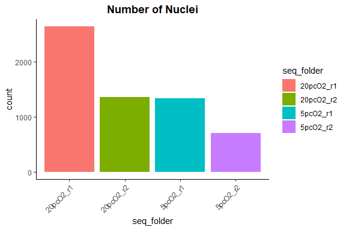

### 1.3.3 Density of nuclei per sample

``` r
ggplot(metadata, aes(color=seq_folder, x=nUMI, fill= seq_folder)) + 
  geom_density(alpha = 0.2) + 
  scale_x_log10() + 
  theme_classic() +
  ylab("Cell density") +
  geom_vline(xintercept = 500)
```

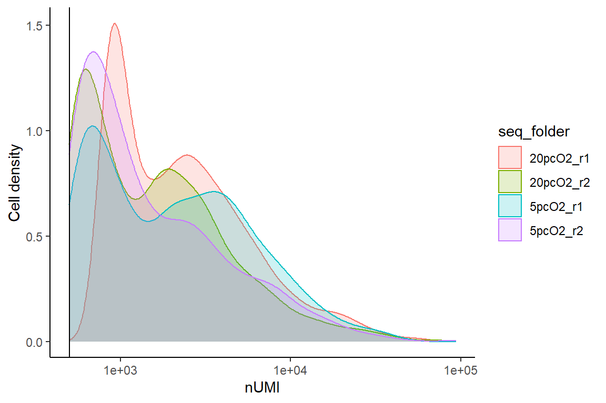

### 1.3.4 Nubmer of Nuclei vs. genes

``` r
ggplot(metadata, aes(x=seq_folder, y=log10(nGene), fill=seq_folder)) + 
  geom_boxplot() + 
  theme_classic() +
  theme(axis.text.x = element_text(angle = 45, vjust = 1, hjust=1)) +
  theme(plot.title = element_text(hjust=0.5, face="bold")) +
  ggtitle("NNuclei vs NGenes")
```

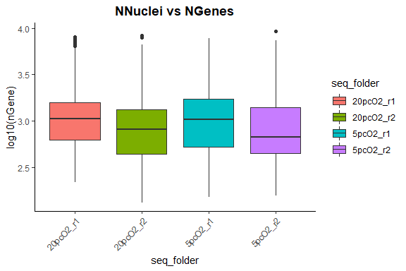

### 1.3.5 Nubmer of Nuclei vs. genes

``` r
ggplot(metadata, aes(x=log10GenesPerUMI, color = seq_folder, fill=seq_folder)) +
  geom_density(alpha = 0.2) +
  theme_classic() +
  geom_vline(xintercept = 0.8)
```

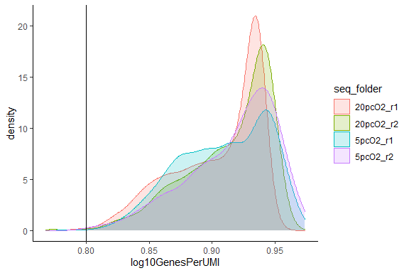

### 1.3.6 Nubmer of Nuclei vs. genes

``` r
ggplot(metadata, aes(color=seq_folder, x=mitoRatio, fill=seq_folder)) + 
  geom_density(alpha = 0.2) + 
  scale_x_log10() + 
  theme_classic() +
  geom_vline(xintercept = 0.2)
```

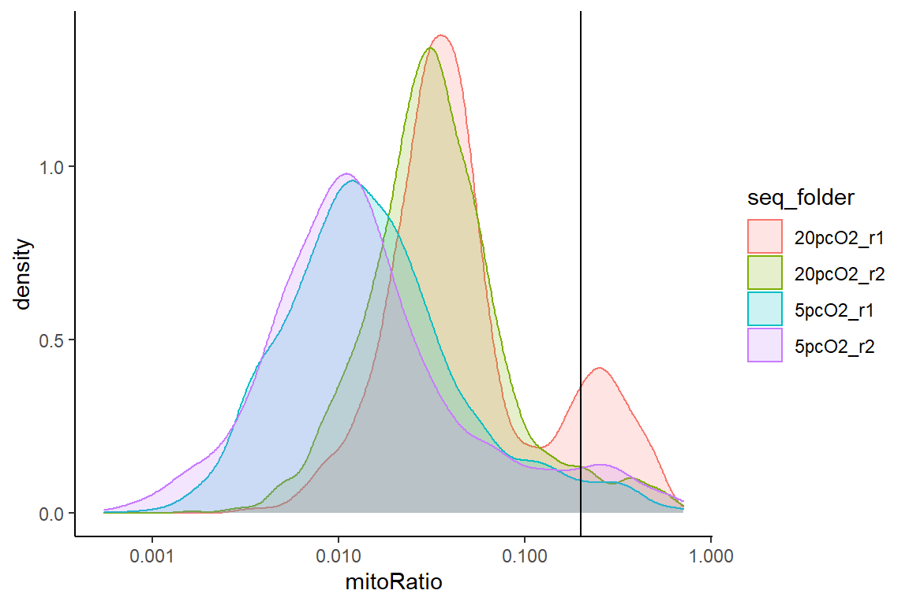<!-- -->

## 1.4 Data filtering

After inspection, we decided to remove all mitochondiral genes as well
as ribosomal genes from our analyses.

### 1.4.1 set up the metadata file and organize

``` r
bapd8.combined <- bapd8.temp
df <- bapd8.combined@meta.data
df$replicate <- NA
df$replicate[which(str_detect(df$orig.ident, "5pcO2"))] <- "5pcO2"
df$replicate[which(str_detect(df$orig.ident, "20pcO2"))] <- "20pcO2"
bapd8.combined@meta.data <- df
bapd8.combined[["percent.mt"]] <- PercentageFeatureSet(bapd8.combined, pattern = "^MT-")
#datatable(bapd8.combined@meta.data, rownames = TRUE, filter="top", options = list(pageLength = 15, scrollX=T) )
```

### 1.4.2 set up the metadata file and organize

``` r
v1 <- VlnPlot(bapd8.combined, features = "nFeature_RNA", pt.size = 1) + 
  geom_hline(yintercept=200, color = "red", size=1) +
  geom_hline(yintercept=7500, color = "red", size=1) +
  theme(legend.position = "none")
v2 <- VlnPlot(bapd8.combined, features = "nCount_RNA", pt.size = 1) +
  theme(legend.position = "none")
v3 <- VlnPlot(bapd8.combined, features = "percent.mt", pt.size = 1) +
  geom_hline(yintercept=15, color = "red", size=1) +
  theme(legend.position = "none")
v1 | v2 | v3
```

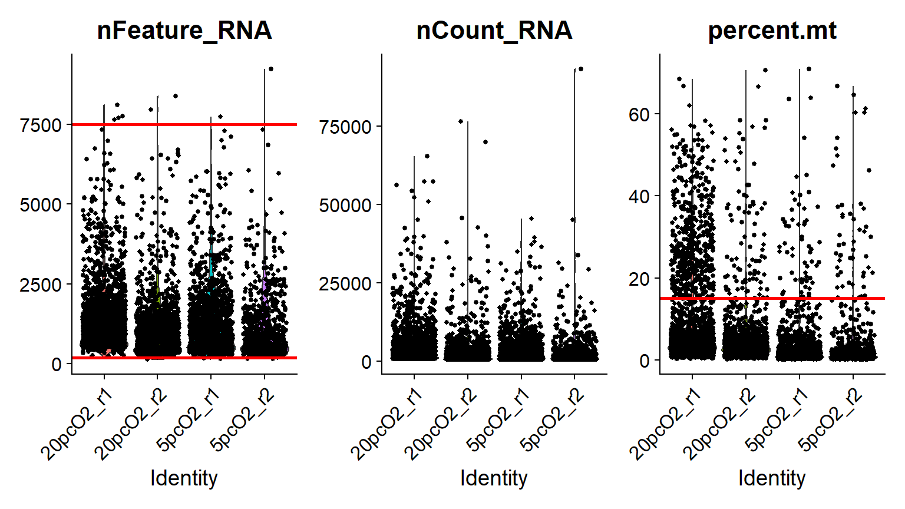<!-- -->

### 1.4.3 Before filtering

``` r
B1 <- FeatureScatter(bapd8.combined, feature1 = "nCount_RNA", feature2 = "percent.mt")
B2 <- FeatureScatter(bapd8.combined, feature1 = "nCount_RNA", feature2 = "nFeature_RNA")
B1 | B2
```

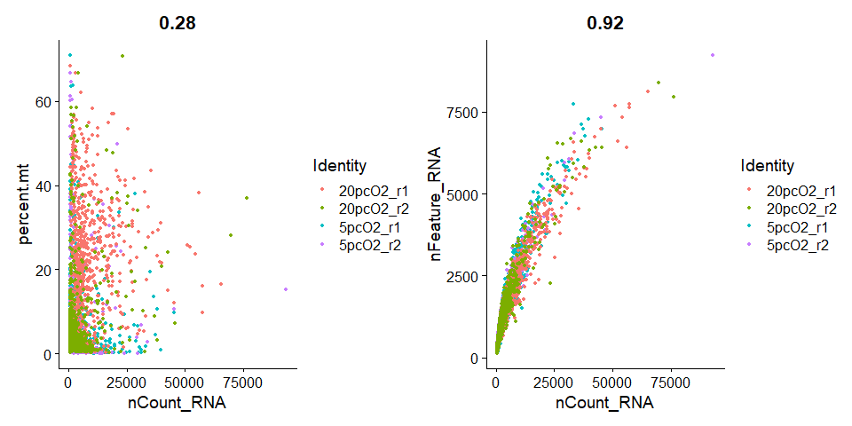<!-- -->

### 1.4.4 Preliminary filtering

``` r
bapd8.combined <- subset(bapd8.combined, subset = nFeature_RNA > 200 & nFeature_RNA < 7500 & percent.mt < 25)
I1 <- FeatureScatter(bapd8.combined, feature1 = "nCount_RNA", feature2 = "percent.mt")
I2 <- FeatureScatter(bapd8.combined, feature1 = "nCount_RNA", feature2 = "nFeature_RNA")

I1 | I2
```

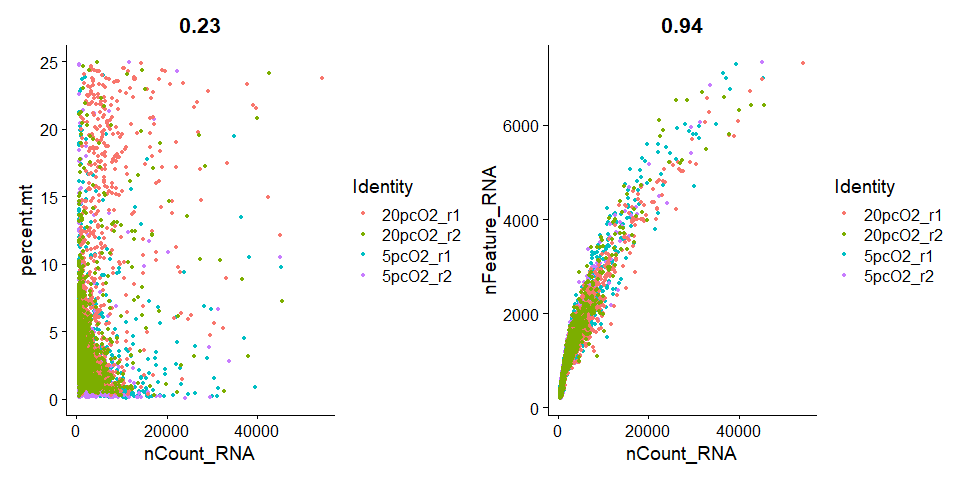<!-- -->

### 1.4.5 Final filtering

``` r
bapd8.combined <- subset(bapd8.combined, subset = nFeature_RNA > 200 & nFeature_RNA < 7500 & percent.mt < 15)
A1 <- FeatureScatter(bapd8.combined, feature1 = "nCount_RNA", feature2 = "percent.mt")
A2 <- FeatureScatter(bapd8.combined, feature1 = "nCount_RNA", feature2 = "nFeature_RNA")
A1 | A2
```

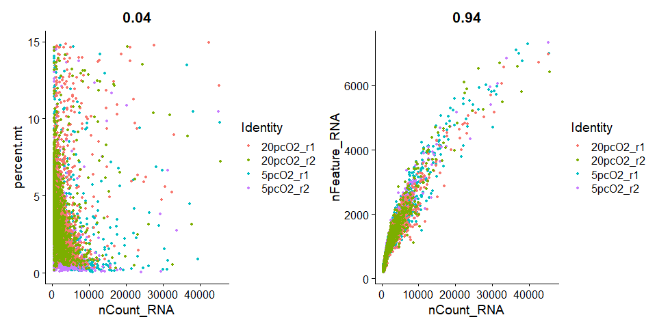<!-- -->

### 1.4.6 Removing ribosomal and MT proteins

``` r
counts <- GetAssayData(object = bapd8.combined, slot = "counts")
counts <- counts[grep(pattern = "^MT", x = rownames(counts), invert = TRUE),]
counts <- counts[grep(pattern = "^MT", x = rownames(counts), invert = TRUE),]
counts <- counts[grep(pattern = "^RPL", x = rownames(counts), invert = TRUE),]
counts <- counts[grep(pattern = "^RPS", x = rownames(counts), invert = TRUE),]
counts <- counts[grep(pattern = "^MRPS", x = rownames(counts), invert = TRUE),]
counts <- counts[grep(pattern = "^MRPL", x = rownames(counts), invert = TRUE),]
keep_genes <- Matrix::rowSums(counts) >= 10
filtered_counts <- counts[keep_genes, ]
bapd8.fcombined <- CreateSeuratObject(filtered_counts, meta.data = bapd8.combined@meta.data)
bapd8.fcombined@meta.data <- bapd8.fcombined@meta.data[1:4]
bapd8.combined <- bapd8.fcombined
```

## 1.5 Data integration and Clustering

`Seurat` package was used for integrating samples and running the
snRNAseq analyses.

### 1.5.1 data integration

``` r
bapd8.list <- SplitObject(bapd8.combined, split.by = "orig.ident")
bapd8.list <- lapply(X = bapd8.list, FUN = function(x) {
  x <- NormalizeData(x)
  x <- FindVariableFeatures(x, selection.method = "vst", nfeatures = 2000)
})
```

### 1.5.2 Seurat

``` r
bapd8.anchors <- FindIntegrationAnchors(object.list = bapd8.list, dims = 1:20)
#> Computing 2000 integration features
#> Scaling features for provided objects
#> Finding all pairwise anchors
#> Running CCA
#> Merging objects
#> Finding neighborhoods
#> Finding anchors
#>  Found 2408 anchors
#> Filtering anchors
#>  Retained 2164 anchors
#> Running CCA
#> Merging objects
#> Finding neighborhoods
#> Finding anchors
#>  Found 4414 anchors
#> Filtering anchors
#>  Retained 2166 anchors
#> Running CCA
#> Merging objects
#> Finding neighborhoods
#> Finding anchors
#>  Found 2896 anchors
#> Filtering anchors
#>  Retained 1336 anchors
#> Running CCA
#> Merging objects
#> Finding neighborhoods
#> Finding anchors
#>  Found 3583 anchors
#> Filtering anchors
#>  Retained 2186 anchors
#> Running CCA
#> Merging objects
#> Finding neighborhoods
#> Finding anchors
#>  Found 2628 anchors
#> Filtering anchors
#>  Retained 1587 anchors
#> Running CCA
#> Merging objects
#> Finding neighborhoods
#> Finding anchors
#>  Found 4765 anchors
#> Filtering anchors
#>  Retained 2767 anchors
bapd8.integrated <- IntegrateData(anchorset = bapd8.anchors, dims = 1:20)
#> Merging dataset 2 into 1
#> Extracting anchors for merged samples
#> Finding integration vectors
#> Finding integration vector weights
#> Integrating data
#> Merging dataset 4 into 3
#> Extracting anchors for merged samples
#> Finding integration vectors
#> Finding integration vector weights
#> Integrating data
#> Merging dataset 1 2 into 3 4
#> Extracting anchors for merged samples
#> Finding integration vectors
#> Finding integration vector weights
#> Integrating data
#> Warning: Adding a command log without an assay associated with it
DefaultAssay(bapd8.integrated) <- "integrated"
bapd8.integrated <- ScaleData(bapd8.integrated, verbose = FALSE)
bapd8.integrated <- RunPCA(bapd8.integrated, npcs = 30, verbose = FALSE)
bapd8.integrated <- RunUMAP(bapd8.integrated, reduction = "pca", dims = 1:20)
#> Warning: The default method for RunUMAP has changed from calling Python UMAP via reticulate to the R-native UWOT using the cosine metric
#> To use Python UMAP via reticulate, set umap.method to 'umap-learn' and metric to 'correlation'
#> This message will be shown once per session
#> 13:13:18 UMAP embedding parameters a = 0.9922 b = 1.112
#> 13:13:18 Read 5355 rows and found 20 numeric columns
#> 13:13:18 Using Annoy for neighbor search, n_neighbors = 30
#> 13:13:18 Building Annoy index with metric = cosine, n_trees = 50
#> 0%   10   20   30   40   50   60   70   80   90   100%
#> [----|----|----|----|----|----|----|----|----|----|
#> **************************************************|
#> 13:13:19 Writing NN index file to temp file C:\Users\arnstrm\AppData\Local\Temp\RtmpspqJms\file489c20e959d0
#> 13:13:19 Searching Annoy index using 1 thread, search_k = 3000
#> 13:13:20 Annoy recall = 100%
#> 13:13:20 Commencing smooth kNN distance calibration using 1 thread
#> 13:13:21 Initializing from normalized Laplacian + noise
#> 13:13:22 Commencing optimization for 500 epochs, with 238960 positive edges
#> 13:13:33 Optimization finished
bapd8.integrated <- FindNeighbors(bapd8.integrated, reduction = "pca", dims = 1:20)
#> Computing nearest neighbor graph
#> Computing SNN
bapd8.integrated <- FindClusters(bapd8.integrated, resolution = 0.5)
#> Modularity Optimizer version 1.3.0 by Ludo Waltman and Nees Jan van Eck
#> 
#> Number of nodes: 5355
#> Number of edges: 245961
#> 
#> Running Louvain algorithm...
#> Maximum modularity in 10 random starts: 0.8728
#> Number of communities: 9
#> Elapsed time: 0 seconds
```

### 1.5.3 renumber the clusters

By default `Seurat` assigns the cluster identity starting from zero.
Since we prefer identity starting from one, we renumbered cluster 0-8 to
1-9.

``` r
num.clusters <- nlevels(bapd8.integrated$seurat_clusters)
df <- bapd8.integrated@meta.data
df$new_clusters <- as.factor(as.numeric(df$seurat_clusters))
bapd8.integrated@meta.data <- df
Idents(bapd8.integrated) <- "new_clusters"
```

### 1.5.4 dimplots (colored based on clusters)

The Dimensional reduction plot was plotted using the `Seurat` `DipPlot`
function, with colors representing different groups/clusters.

``` r
d1 <- enhancedDimPlot(object = bapd8.integrated, grouping_var = 'ident', reduction = "umap", label = TRUE, pt.size = 1, alpha = 0.5) +
  ggtitle("A") + xlab("UMAP_1") + ylab("UMAP_2") +
  theme_classic() +
  theme(legend.position = "none", plot.title = element_text(face = "bold"))
#ggplotly(d1)
d1
```


### 1.5.5 dimplots (colored based on conditions)

``` r
d2 <- enhancedDimPlot(object = bapd8.integrated, grouping_var = 'replicate', reduction = "umap", label = FALSE, pt.size = 1, alpha = 0.4) +
  ggtitle("B") +
  xlab("UMAP_1") +
  ylab("UMAP_2") +
  theme_classic() + 
  theme(legend.justification = c(1, 1), legend.position = c(1, 1), plot.title = element_text(face = "bold")) +
  scale_colour_manual(name = "Conditions", 
                      labels = c(expression(paste('20% ', 'O'[2])), expression(paste('5% ', 'O'[2]))), 
                      values = c("20pcO2" = "#0571b0", "5pcO2" = "#ca0020")) +
  scale_fill_manual(name = "Conditions", 
                    labels = c(expression(paste('20% ', 'O'[2])), expression(paste('5% ', 'O'[2]))), 
                    values = c("20pcO2" = "#0571b0", "5pcO2" = "#ca0020")) +
  scale_linetype_manual(values = "blank")
#ggplotly(d2)
d2
```


### 1.5.6 dimplots (colored based on samples)

``` r
d3 <- enhancedDimPlot(object = bapd8.integrated, grouping_var = 'orig.ident', reduction = "umap", label = FALSE, pt.size = 1, alpha = 0.4) +
  ggtitle("C") +
  xlab("UMAP_1") +
  ylab("UMAP_2") +
  theme_classic() + 
  theme(legend.justification = c(1, 1), legend.position = c(1, 1), plot.title = element_text(face = "bold")) +
  scale_colour_manual(name = "Replicates", 
                      labels = c(expression(paste('20% ', 'O'[2], ' rep1')), expression(paste('20% ', 'O'[2], ' rep2')), expression(paste('5% ', 'O'[2], ' rep1')), expression(paste('5% ', 'O'[2], ' rep1'))), 
                      values = c("20pcO2_r1" = "#0571b0", "20pcO2_r2" = "#92c5de", "5pcO2_r1" = "#ca0020", "5pcO2_r2" = "#f4a582")) +
  scale_fill_manual(name = "Replicates", 
                    labels = c(expression(paste('20% ', 'O'[2], ' rep1')), expression(paste('20% ', 'O'[2], ' rep2')), expression(paste('5% ', 'O'[2], ' rep1')), expression(paste('5% ', 'O'[2], ' rep1'))), 
                    values = c("20pcO2_r1" = "#0571b0", "20pcO2_r2" = "#92c5de", "5pcO2_r1" = "#ca0020", "5pcO2_r2" = "#f4a582")) +
  scale_linetype_manual(values = "blank")

#ggplotly(d3)
d3
```


## 1.6 Find markers

Find markers for each cluster. The `Seurat` command `FindMarkers` was
run using the cluster identity assigned in the previous step. Additional
column with the Fold (converted from natural log fold change of seurat
output) was added to the table. The filtering was done for genes with
`avg_FC` &gt;= 1.5 and `p_val_adj` &lt;= 0.05.

``` r
DefaultAssay(bapd8.integrated) <- "RNA"
lhs.a  <- paste("markers.all.", 1:num.clusters, sep="")
rhs.a <- paste("FindMarkers(bapd8.integrated, ident.1 = ",1:num.clusters," )", sep="")
commands.a <- paste(paste(lhs.a, rhs.a, sep="<-"), collapse=";")
eval(parse(text=commands.a))
lhs.b  <- paste("markers.all.", 1:num.clusters, "$avg_FC", sep="")
rhs.b <- paste("exp(markers.all.",1:num.clusters,"$avg_logFC)", sep="")
commands.b <- paste(paste(lhs.b, rhs.b, sep="<-"), collapse=";")
eval(parse(text=commands.b))
lhs.c  <- paste("markers.filtered.", 1:num.clusters, sep="")
rhs.c <- paste("markers.all.",1:num.clusters," %>% filter(avg_FC >= 1.5) %>% filter(p_val_adj <= 0.05) %>% arrange(desc(avg_FC))", sep="")
commands.c <- paste(paste(lhs.c, rhs.c, sep="<-"), collapse=";")
eval(parse(text=commands.c))
lhs.d  <- paste("markers.filtered.names.", 1:num.clusters, sep="")
rhs.d <- paste("rownames(markers.filtered.",1:num.clusters,")", sep="")
commands.d <- paste(paste(lhs.d, rhs.d, sep="<-"), collapse=";")
eval(parse(text=commands.d))
```

### 1.6.1 Check the number of markers

``` r
message (paste("Cluster 1 as", length(markers.filtered.names.1), "markers", sep = " "))
#> Cluster 1 as 122 markers
message (paste("Cluster 2 as", length(markers.filtered.names.2), "markers", sep = " "))
#> Cluster 2 as 192 markers
message (paste("Cluster 3 as", length(markers.filtered.names.3), "markers", sep = " "))
#> Cluster 3 as 607 markers
message (paste("Cluster 4 as", length(markers.filtered.names.4), "markers", sep = " "))
#> Cluster 4 as 169 markers
message (paste("Cluster 5 as", length(markers.filtered.names.5), "markers", sep = " "))
#> Cluster 5 as 309 markers
message (paste("Cluster 6 as", length(markers.filtered.names.6), "markers", sep = " "))
#> Cluster 6 as 408 markers
message (paste("Cluster 7 as", length(markers.filtered.names.7), "markers", sep = " "))
#> Cluster 7 as 200 markers
message (paste("Cluster 8 as", length(markers.filtered.names.8), "markers", sep = " "))
#> Cluster 8 as 174 markers
message (paste("Cluster 9 as", length(markers.filtered.names.9), "markers", sep = " "))
#> Cluster 9 as 398 markers
```

## 1.7 Marker plots

Combined expression of all the markers genes in various clusters. The
markers have higher expression in their respecitve cluster than compared
to rest of the clusters.

``` r
ggplotColours <- function(n = 6, h = c(0, 360) + 15){
  if ((diff(h) %% 360) < 1) h[2] <- h[2] - 360/n
  hcl(h = (seq(h[1], h[2], length = n)), c = 100, l = 65)
}

color_list <- ggplotColours(n=9)

grouped_violinPlots <- function(markersfile, clusternumber, seuratobject = bapd8.integrated) {
  dittoPlotVarsAcrossGroups(seuratobject, markersfile, 
                            group.by = "new_clusters", main = paste("Cluster ", clusternumber, " markers"), 
                            xlab = "Clusters", 
                            ylab = "Mean z-score expression", 
                            x.labels = c("Cluster 1", "Cluster 2", "Cluster 3", "Cluster 4",
                                         "Cluster 5", "Cluster 6", "Cluster 7", "Cluster 8", "Cluster 9"), 
                            vlnplot.lineweight = 0.5, 
                            legend.show = FALSE, 
                            jitter.size = 0.5, 
                            color.panel = color_list)
}
```

### 1.7.1 Markers of cluster 1

``` r
grouped_violinPlots(markers.filtered.names.1, 1)
```

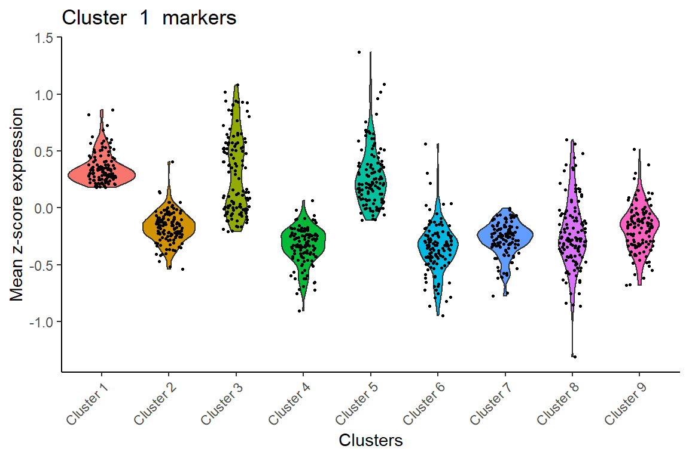<!-- -->

### 1.7.2 Markers of cluster 2

``` r
grouped_violinPlots(markers.filtered.names.2, 2)
```

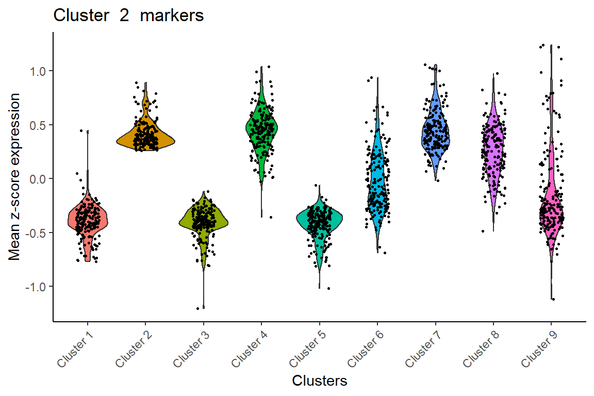<!-- -->

### 1.7.3 Markers of cluster 3

``` r
grouped_violinPlots(markers.filtered.names.3, 3)
```

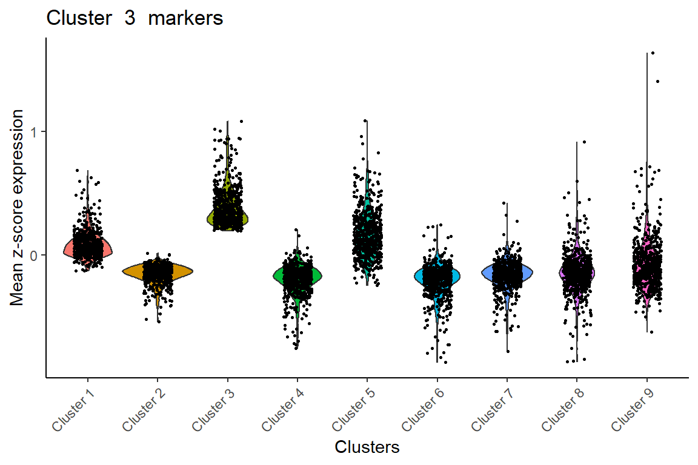<!-- -->

### 1.7.4 Markers of cluster 4

``` r
grouped_violinPlots(markers.filtered.names.4, 4)
```

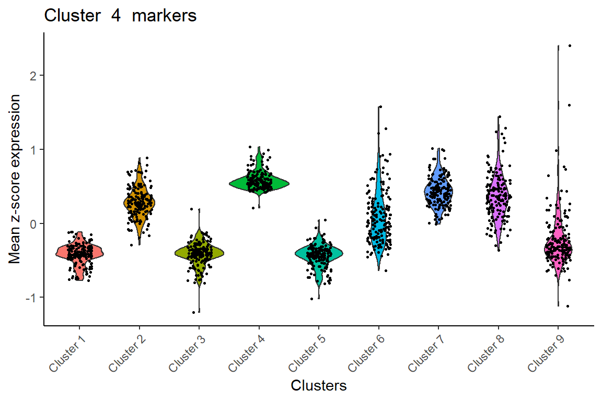<!-- -->

### 1.7.5 Markers of cluster 5

``` r
grouped_violinPlots(markers.filtered.names.5, 5)
```

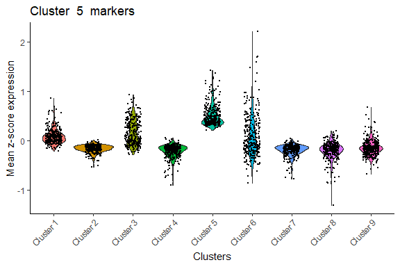<!-- -->

### 1.7.6 Markers of cluster 6

``` r
grouped_violinPlots(markers.filtered.names.6, 6)
```

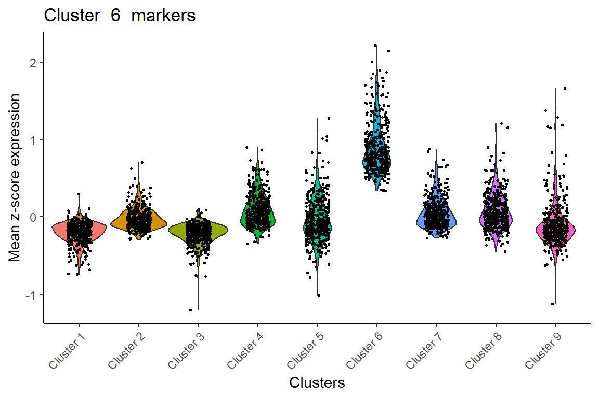<!-- -->

### 1.7.7 Markers of cluster 7

``` r
grouped_violinPlots(markers.filtered.names.7, 7)
```

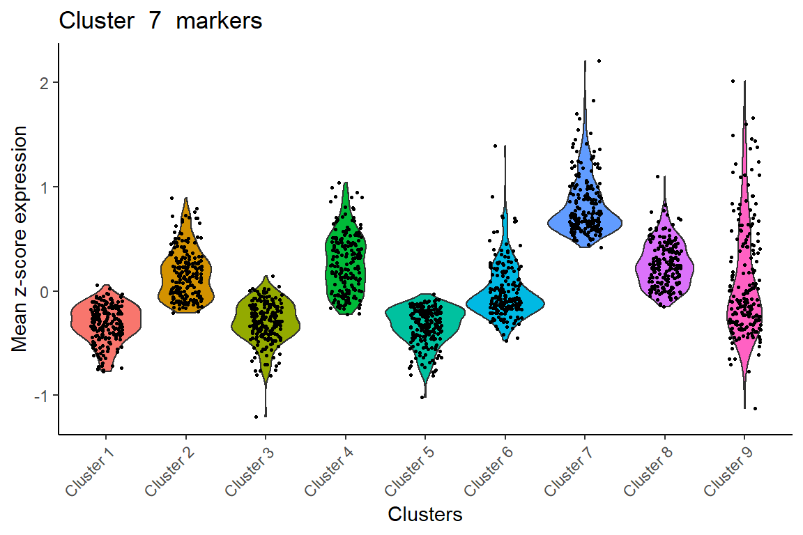<!-- -->

### 1.7.8 Markers of cluster 8

``` r
grouped_violinPlots(markers.filtered.names.8, 8)
```

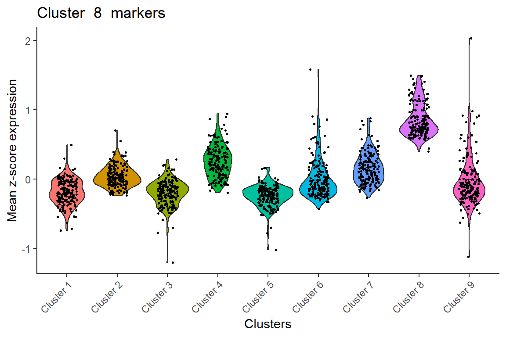<!-- -->

### 1.7.9 Markers of cluster 9

``` r
grouped_violinPlots(markers.filtered.names.9, 9)
```

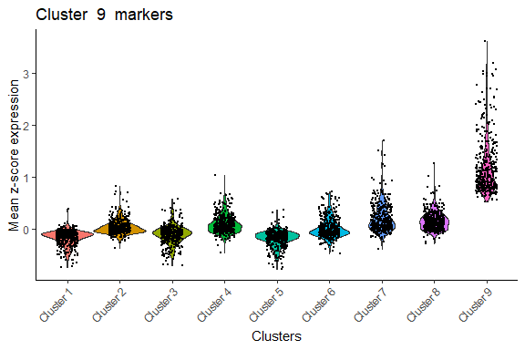<!-- -->

## 1.8 Run PlacentaCellEnrich on markers

[`PlacentaCellEnrich`](https://www.sciencedirect.com/science/article/abs/pii/S0143400420304264)
was run command-line using the
[`TissueEnrich`](https://bioconductor.org/packages/release/bioc/html/TissueEnrich.html)
R package. We used this to assign cell identity to cluster 2, 3, 5 and
6. The function used for running PCE is as follows:

``` r
l <- load(file = "~/TutejaLab/PlacentaEnrich/combine-test-expression1.Rdata")
humanGeneMapping <- dataset$GRCH38$humanGeneMapping
d <- dataset$PlacentaDeciduaBloodData
data <- d$expressionData
cellDetails <- d$cellDetails

runpce <- function(inputgenelist, clusternumber) {
  inputGenes<-toupper(inputgenelist)
  humanGene<-humanGeneMapping[humanGeneMapping$Gene.name %in% inputGenes,]
  inputGenes<-humanGene$Gene
  expressionData<-data[intersect(row.names(data),humanGeneMapping$Gene),]
  se<-SummarizedExperiment(assays = SimpleList(as.matrix(expressionData)),rowData = row.names(expressionData),colData = colnames(expressionData))
  cellSpecificGenesExp<-teGeneRetrieval(se,expressedGeneThreshold = 1)
  se<-SummarizedExperiment(assays = SimpleList(as.matrix(expressionData)),rowData = row.names(expressionData),colData = colnames(expressionData))
  cellSpecificGenesExp<-teGeneRetrieval(se,expressedGeneThreshold = 1)
  print(length(inputGenes))
  gs<-GeneSet(geneIds=toupper(inputGenes))
  output2<-teEnrichmentCustom(gs,cellSpecificGenesExp)
  enrichmentOutput<-setNames(data.frame(assay(output2[[1]]),row.names = rowData(output2[[1]])[,1]),colData(output2[[1]])[,1])
  row.names(cellDetails)<-cellDetails$RName
  enrichmentOutput$Tissue<- cellDetails[row.names(enrichmentOutput),"CellName"]
  ggplot(data = enrichmentOutput, mapping = aes(x = reorder (Tissue, -Log10PValue), Log10PValue, fill= Tissue)) +
    geom_bar(stat = "identity") + theme_minimal() + 
    theme(axis.text.x = element_text(angle = 45, vjust = 1, hjust=1, size = 12),
          axis.text.y = element_text(size = 12),
          plot.margin = margin(10, 10, 10, 100), legend.position = "none",
          plot.title = element_text(color = "black", size=18, face="bold.italic"),
          axis.title.x = element_blank(),
          axis.title.y = element_text(color="black", size=14, face="bold")) +
    scale_y_continuous(expand = expansion(mult = c(0, .1))) +
    ggtitle(paste("Cluster ", clusternumber )) + ylab("-log10 p-value")
}
```

### 1.8.1 PCE for cluster 1 markers

``` r
runpce(markers.filtered.names.1, 1)
#> [1] 140
```

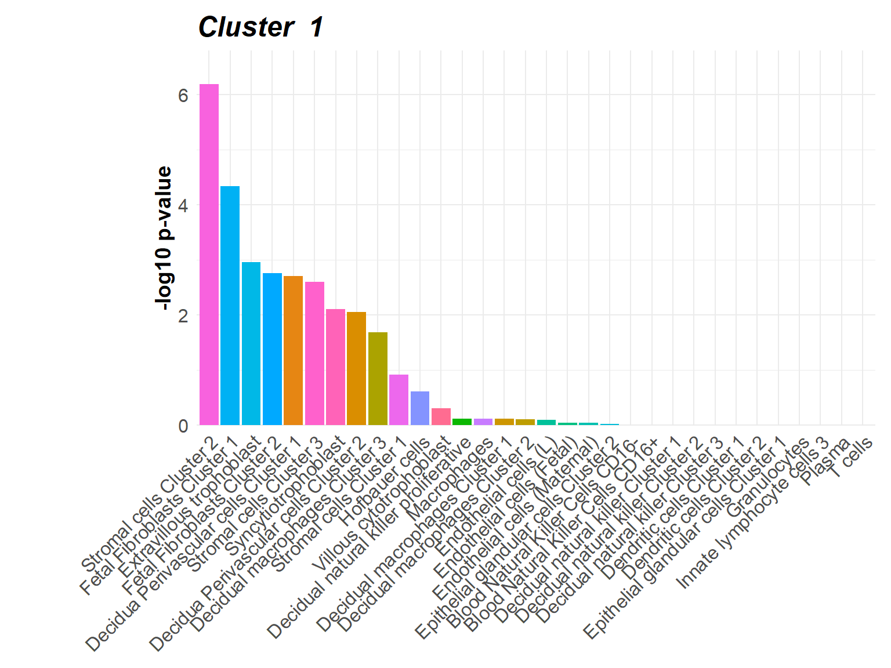<!-- -->

### 1.8.2 PCE for cluster 2 markers

``` r
runpce(markers.filtered.names.2, 2)
#> [1] 168
```

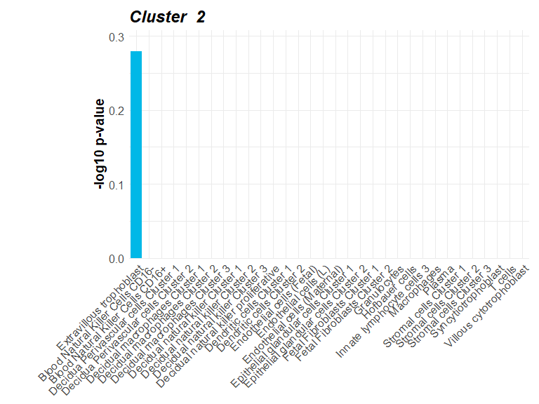<!-- -->

### 1.8.3 PCE for cluster 3 markers

``` r
runpce(markers.filtered.names.3, 3)
#> [1] 667
```

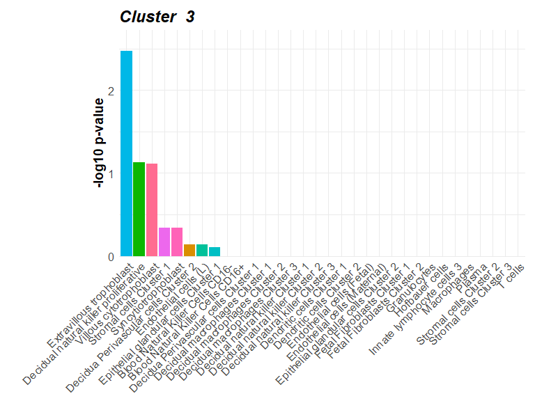<!-- -->

### 1.8.4 PCE for cluster 4 markers

``` r
runpce(markers.filtered.names.4, 4)
#> [1] 145
```

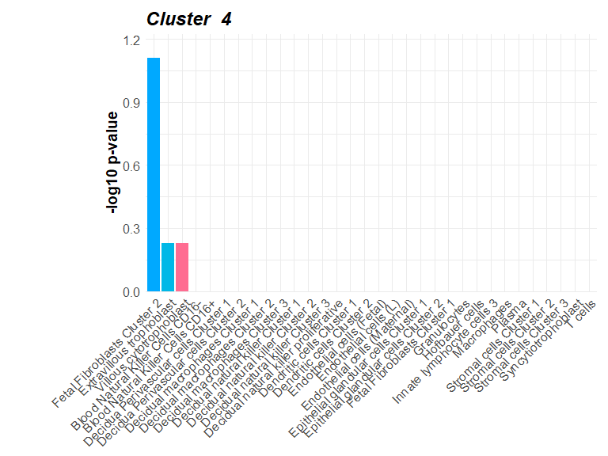<!-- -->

### 1.8.5 PCE for cluster 5 markers

``` r
runpce(markers.filtered.names.5, 5)
#> [1] 310
```

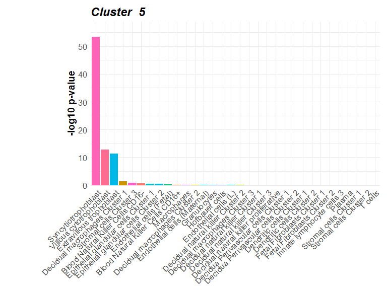<!-- -->

### 1.8.6 PCE for cluster 6 markers

``` r
runpce(markers.filtered.names.6, 6)
#> [1] 376
```

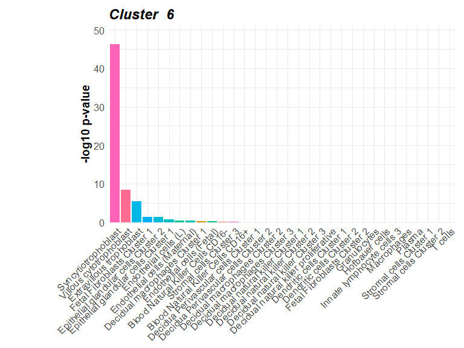<!-- -->

### 1.8.7 PCE for cluster 7 markers

``` r
runpce(markers.filtered.names.7, 7)
#> [1] 188
```

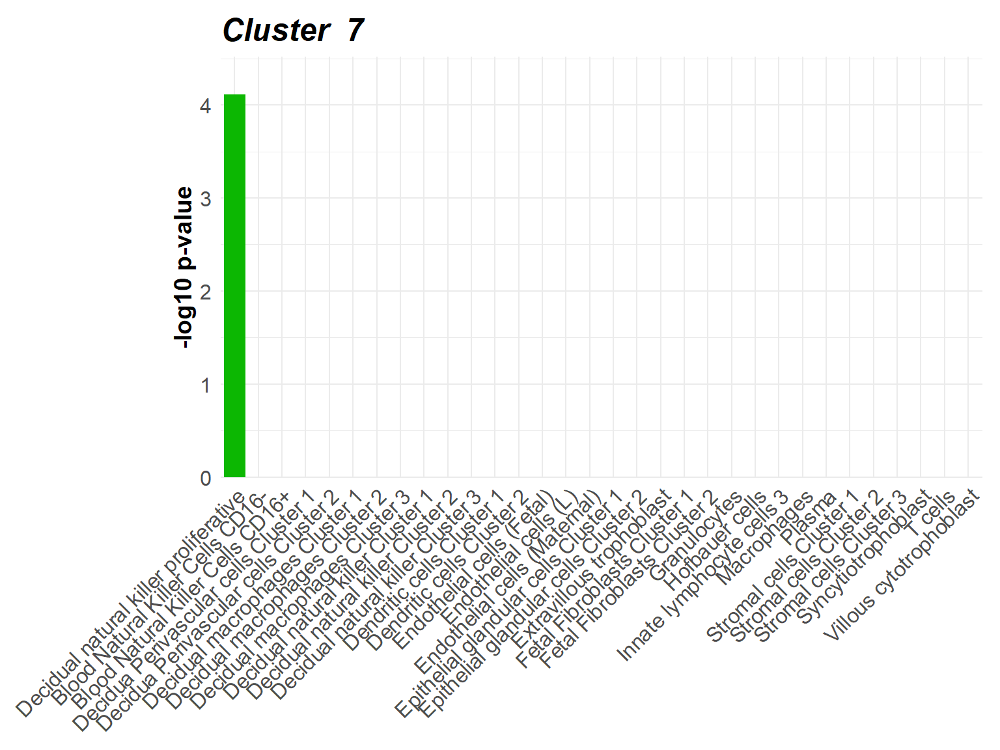<!-- -->

### 1.8.8 PCE for cluster 8 markers

``` r
runpce(markers.filtered.names.8, 8)
#> [1] 162
```

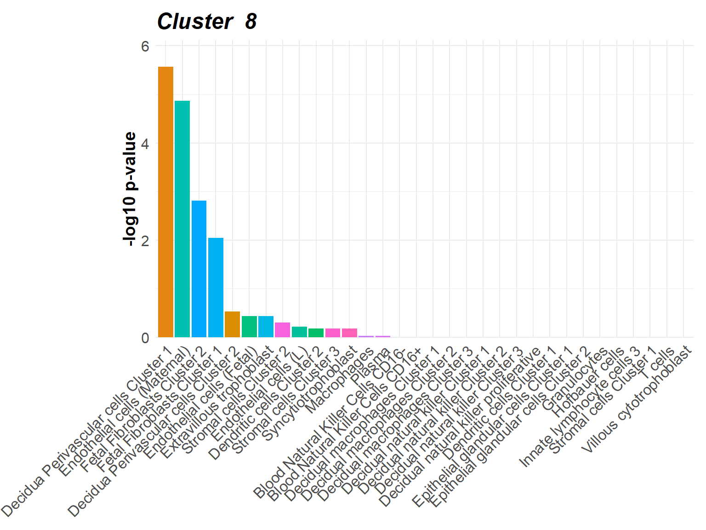<!-- -->

### 1.8.9 PCE for cluster 9 markers

``` r
runpce(markers.filtered.names.9, 9)
#> [1] 407
```

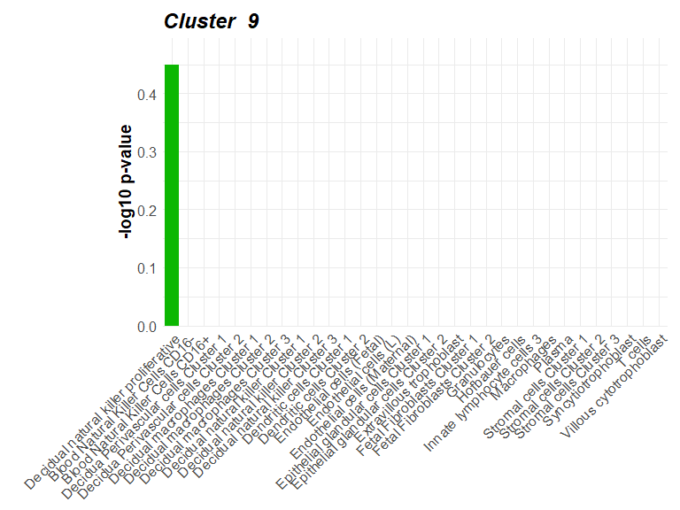<!-- -->

## 1.9 Plotting functions

Some plotting functions that we used for finalizing violin plots.

``` r
# https://divingintogeneticsandgenomics.rbind.io/post/stacked-violin-plot-for-visualizing-single-cell-data-in-seurat/
modify_vlnplot<- function(obj, 
                          feature, 
                          pt.size = 0, 
                          plot.margin = unit(c(-0.75, 0, -0.75, 0), "cm"),
                          ...) {
  p<- VlnPlot(obj, features = feature, pt.size = pt.size, ... )  + 
    xlab("") + ylab(feature) + ggtitle("") + 
    theme(legend.position = "none", 
          axis.text.x = element_blank(), 
          axis.ticks.x = element_blank(), 
          axis.title.y = element_text(size = rel(1), angle = 0), 
          axis.text.y = element_text(size = rel(1)), 
          plot.margin = plot.margin ) 
  return(p)
}

extract_max<- function(p){
  ymax<- max(ggplot_build(p)$layout$panel_scales_y[[1]]$range$range)
  return(ceiling(ymax))
}


StackedVlnPlot<- function(obj, features,
                          pt.size = 0, 
                          plot.margin = unit(c(-0.75, 0, -0.75, 0), "cm"),
                          ...) {
  
  plot_list<- purrr::map(features, function(x) modify_vlnplot(obj = obj,feature = x, ...))
  
  # Add back x-axis title to bottom plot. patchwork is going to support this?
  plot_list[[length(plot_list)]]<- plot_list[[length(plot_list)]] +
    theme(axis.text.x=element_text(), axis.ticks.x = element_line())
  
  # change the y-axis tick to only max value 
  ymaxs<- purrr::map_dbl(plot_list, extract_max)
  plot_list<- purrr::map2(plot_list, ymaxs, function(x,y) x + 
                            scale_y_continuous(breaks = c(y)) + 
                            expand_limits(y = y))
  
  p<- patchwork::wrap_plots(plotlist = plot_list, ncol = 1)
  return(p)
}
```

### 1.9.1 Find all Markers

Find all markers using the in build function of `Seurat`

``` r
bapd8.markers <- FindAllMarkers(bapd8.integrated, only.pos = TRUE, min.pct = 0.25, logfc.threshold = 0.25)
#> Calculating cluster 1
#> Calculating cluster 2
#> Calculating cluster 3
#> Calculating cluster 4
#> Calculating cluster 5
#> Calculating cluster 6
#> Calculating cluster 7
#> Calculating cluster 8
#> Calculating cluster 9
bapd8.markers.ranked.10.percluster <- bapd8.markers %>% group_by(cluster) %>% top_n(n = 10, wt = avg_logFC)
#datatable(bapd8.markers.ranked.10.percluster, rownames = FALSE, filter="top", options = list(pageLength = 10, scrollX=T))
```

### 1.9.2 Find Conserved markers

This is optional. We did not use the marker genes specific for clusters
of each condition.

``` r
lhs.f  <- paste("markers.conserved.", 1:num.clusters, sep="")
rhs.f <- paste("FindConservedMarkers(bapd8.integrated, ident.1 = ",1:num.clusters,', grouping.var = "replicate", verbose = FALSE)', sep="")
commands.f <- paste(paste(lhs.f, rhs.f, sep="<-"), collapse=";")
eval(parse(text=commands.f))
```

### 1.9.3 Expression tables

To export average expression levels for all genes, summarized based on
all cells, each condition and each replicate, we used
`AverageExpression` command for `Seurat`.

``` r
cluster.averages.data <- AverageExpression(bapd8.integrated, slot = "data", assays = "RNA")
#> Finished averaging RNA for cluster 1
#> Finished averaging RNA for cluster 2
#> Finished averaging RNA for cluster 3
#> Finished averaging RNA for cluster 4
#> Finished averaging RNA for cluster 5
#> Finished averaging RNA for cluster 6
#> Finished averaging RNA for cluster 7
#> Finished averaging RNA for cluster 8
#> Finished averaging RNA for cluster 9
condition.averages.data <- AverageExpression(bapd8.integrated, slot = "data", add.ident = "orig.ident", assays = "RNA")
#> Finished averaging RNA for cluster 3_5pcO2_r1
#> Finished averaging RNA for cluster 4_5pcO2_r1
#> Finished averaging RNA for cluster 7_5pcO2_r1
#> Finished averaging RNA for cluster 2_5pcO2_r1
#> Finished averaging RNA for cluster 1_5pcO2_r1
#> Finished averaging RNA for cluster 6_5pcO2_r1
#> Finished averaging RNA for cluster 9_5pcO2_r1
#> Finished averaging RNA for cluster 5_5pcO2_r1
#> Finished averaging RNA for cluster 8_5pcO2_r1
#> Finished averaging RNA for cluster 1_5pcO2_r2
#> Finished averaging RNA for cluster 7_5pcO2_r2
#> Finished averaging RNA for cluster 2_5pcO2_r2
#> Finished averaging RNA for cluster 5_5pcO2_r2
#> Finished averaging RNA for cluster 4_5pcO2_r2
#> Finished averaging RNA for cluster 6_5pcO2_r2
#> Finished averaging RNA for cluster 9_5pcO2_r2
#> Finished averaging RNA for cluster 3_5pcO2_r2
#> Finished averaging RNA for cluster 8_5pcO2_r2
#> Finished averaging RNA for cluster 2_20pcO2_r1
#> Finished averaging RNA for cluster 7_20pcO2_r1
#> Finished averaging RNA for cluster 1_20pcO2_r1
#> Finished averaging RNA for cluster 5_20pcO2_r1
#> Finished averaging RNA for cluster 4_20pcO2_r1
#> Finished averaging RNA for cluster 3_20pcO2_r1
#> Finished averaging RNA for cluster 6_20pcO2_r1
#> Finished averaging RNA for cluster 8_20pcO2_r1
#> Finished averaging RNA for cluster 9_20pcO2_r1
#> Finished averaging RNA for cluster 5_20pcO2_r2
#> Finished averaging RNA for cluster 4_20pcO2_r2
#> Finished averaging RNA for cluster 7_20pcO2_r2
#> Finished averaging RNA for cluster 1_20pcO2_r2
#> Finished averaging RNA for cluster 3_20pcO2_r2
#> Finished averaging RNA for cluster 2_20pcO2_r2
#> Finished averaging RNA for cluster 8_20pcO2_r2
#> Finished averaging RNA for cluster 6_20pcO2_r2
#> Finished averaging RNA for cluster 9_20pcO2_r2
replicate.averages.data <- AverageExpression(bapd8.integrated, slot = "data", add.ident = "replicate", assays = "RNA")
#> Finished averaging RNA for cluster 3_5pcO2
#> Finished averaging RNA for cluster 4_5pcO2
#> Finished averaging RNA for cluster 7_5pcO2
#> Finished averaging RNA for cluster 2_5pcO2
#> Finished averaging RNA for cluster 1_5pcO2
#> Finished averaging RNA for cluster 6_5pcO2
#> Finished averaging RNA for cluster 9_5pcO2
#> Finished averaging RNA for cluster 5_5pcO2
#> Finished averaging RNA for cluster 8_5pcO2
#> Finished averaging RNA for cluster 2_20pcO2
#> Finished averaging RNA for cluster 7_20pcO2
#> Finished averaging RNA for cluster 1_20pcO2
#> Finished averaging RNA for cluster 5_20pcO2
#> Finished averaging RNA for cluster 4_20pcO2
#> Finished averaging RNA for cluster 3_20pcO2
#> Finished averaging RNA for cluster 6_20pcO2
#> Finished averaging RNA for cluster 8_20pcO2
#> Finished averaging RNA for cluster 9_20pcO2
avg.data <- cluster.averages.data[["RNA"]]
avg.condition <- condition.averages.data[["RNA"]]
avg.replicate <- replicate.averages.data[["RNA"]]
write.table(avg.data, file="snn-average-data.tsv", sep= "\t")
write.table(avg.condition, file="snn-average-condition.tsv", sep= "\t")
write.table(avg.replicate, file="snn-average-replicate.tsv", sep= "\t")
avg.data$gene <- row.names(avg.data)
avg.data <- as_data_frame(avg.data)
#> Warning: `as_data_frame()` was deprecated in tibble 2.0.0.
#> Please use `as_tibble()` instead.
#> The signature and semantics have changed, see `?as_tibble`.
avg.data <- avg.data[, c(10, 1, 2, 3, 4, 5, 6, 7, 8, 9)]
colnames(avg.data) <- c("Gene", paste("Cluster", colnames(avg.data[2:10]), sep = "_"))
#datatable(avg.data, rownames = FALSE, filter="top", options = list(pageLength = 10, scrollX=T))
```

### 1.9.4 Cell numbers per clusters

Generate a summary table showing the number of cells in each cluster,
broken down by replicates and treatment.

``` r
cells <- bapd8.integrated@meta.data %>%
  dplyr::group_by(orig.ident,   new_clusters, replicate)    %>% 
  dplyr::summarise(length(new_clusters)) %>%
  dplyr::rename(sample = orig.ident,
                cluster = new_clusters,
                condition = replicate,
                number.of.cells = `length(new_clusters)`)
#> `summarise()` has grouped output by 'orig.ident', 'new_clusters'. You can override using the `.groups` argument.

#head(cells)
#datatable(cells, rownames = TRUE, filter="top", options = list(pageLength = 10, scrollX=T))
#cells %>% 
 # group_by(orig.ident, new_clusters ) %>%
 # summarize(`length(new_clusters)`)

ggplot(cells, aes(x = cluster, y = number.of.cells, fill = cluster )) +
  geom_col() +
  facet_wrap(~condition) +
  theme_classic() +
  theme(legend.position = "none")
```

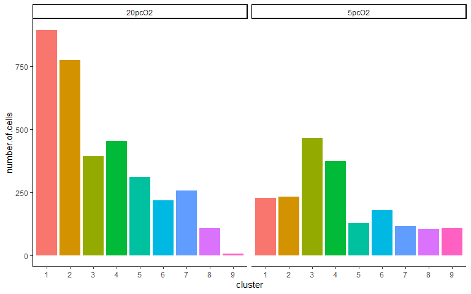<!-- -->

## 1.10 DE between conditions

The DE was carried out between the conditions for each cluster. First we
modified the metadata to create a separate column that has both the
condition as well as the cluster number and then we use the `Seurat`’s
`FindMarkers` to find the genes that are differentially expressed. The
genes that have log2FC &gt; 1 or &lt;-1 are shown in color if they alos
have p-val &lt;0.05.

``` r
head(bapd8.integrated@meta.data)
#>                           orig.ident nCount_RNA nFeature_RNA replicate
#> AAACGCTAGCCGATAG-5pcO2_r1   5pcO2_r1       1746         1020     5pcO2
#> AAAGAACTCATTTCCA-5pcO2_r1   5pcO2_r1       4450         2141     5pcO2
#> AAAGGATTCCGTAGTA-5pcO2_r1   5pcO2_r1       3583         1222     5pcO2
#> AAAGGTAGTAGGGAGG-5pcO2_r1   5pcO2_r1       5636         2037     5pcO2
#> AAAGGTATCTTTACAC-5pcO2_r1   5pcO2_r1       8733         2431     5pcO2
#> AAAGTGAAGAGGGTGG-5pcO2_r1   5pcO2_r1       3364         1693     5pcO2
#>                           integrated_snn_res.0.5 seurat_clusters new_clusters
#> AAACGCTAGCCGATAG-5pcO2_r1                      2               2            3
#> AAAGAACTCATTTCCA-5pcO2_r1                      3               3            4
#> AAAGGATTCCGTAGTA-5pcO2_r1                      3               3            4
#> AAAGGTAGTAGGGAGG-5pcO2_r1                      3               3            4
#> AAAGGTATCTTTACAC-5pcO2_r1                      3               3            4
#> AAAGTGAAGAGGGTGG-5pcO2_r1                      6               6            7
df <- bapd8.integrated@meta.data
df$stim <- (paste(df$replicate,df$new_clusters, sep = "."))
df$stim <- gsub('5pcO2', 'FIVE', df$stim)
df$stim <- gsub('20pcO2', 'TWENTY', df$stim)
bapd8.integrated@meta.data <- df
Idents(bapd8.integrated) <- "stim"
lhs.g  <- paste("clus", 1:num.clusters, ".five.twenty", sep="")
rhs.g <- paste('FindMarkers(bapd8.integrated, ident.1 = "FIVE.', 1:num.clusters, '", ident.2 = "TWENTY.', 1:num.clusters, '", verbose = FALSE, logfc.threshold = 0)', sep="")
commands.g <- paste(paste(lhs.g, rhs.g, sep="<-"), collapse=";")
eval(parse(text=commands.g))
lhs.h  <- paste("clus", 1:num.clusters, ".five.twenty$log2fc", sep="")
rhs.h <- paste('log2(exp(clus', 1:num.clusters, '.five.twenty$avg_logFC))', sep="")
commands.h <- paste(paste(lhs.h, rhs.h, sep="<-"), collapse=";")
eval(parse(text=commands.h))
lhs.j  <- paste("clus", 1:num.clusters, ".five.twenty$Gene", sep="")
rhs.j <- paste('row.names(clus', 1:num.clusters, '.five.twenty)', sep="")
commands.j <- paste(paste(lhs.j, rhs.j, sep="<-"), collapse=";")
eval(parse(text=commands.j))
lhs.k  <- paste("clus", 1:num.clusters, '.five.twenty$diffexpressed <- "other genes"', sep="")
commands.k <- paste(lhs.k , sep=";")
eval(parse(text=commands.k))
lhs.l  <- paste('clus', 1:num.clusters,'.five.twenty$diffexpressed[clus',1:num.clusters,'.five.twenty$log2fc >= 1 & clus', 1:num.clusters,'.five.twenty$p_val < 0.05] <- "up in 20% O2"', sep="")
commands.l <- paste(lhs.l , sep=";")
eval(parse(text=commands.l))
lhs.m  <- paste('clus', 1:num.clusters,'.five.twenty$diffexpressed[clus',1:num.clusters,'.five.twenty$log2fc <= -1 & clus', 1:num.clusters,'.five.twenty$p_val < 0.05] <- "up in 5% O2"', sep="")
commands.m <- paste(lhs.m , sep=";")
eval(parse(text=commands.m))
lhs.n  <- paste('clus', 1:num.clusters,'.five.twenty$delabel <- ""', sep="")
commands.n <- paste(lhs.n , sep=";")
eval(parse(text=commands.n))
lhs.o  <- paste('clus', 1:num.clusters,'.five.twenty$delabel[clus', 1:num.clusters,'.five.twenty$log2fc >= 1 & clus', 1:num.clusters,'.five.twenty$p_val < 0.05]', sep="")
rhs.o  <- paste('clus', 1:num.clusters,'.five.twenty$Gene[clus', 1:num.clusters,'.five.twenty$log2fc >= 1 & clus', 1:num.clusters,'.five.twenty$p_val < 0.05]', sep="")
commands.o <- paste(paste(lhs.o, rhs.o, sep="<-"), collapse=";")
eval(parse(text=commands.o))
lhs.p  <- paste('clus', 1:num.clusters,'.five.twenty$delabel[clus', 1:num.clusters,'.five.twenty$log2fc < -1 & clus', 1:num.clusters,'.five.twenty$p_val < 0.05]', sep="") 
rhs.p  <- paste('clus', 1:num.clusters,'.five.twenty$Gene[clus', 1:num.clusters,'.five.twenty$log2fc < -1 & clus', 1:num.clusters,'.five.twenty$p_val < 0.05]', sep="")
commands.p <- paste(paste(lhs.p, rhs.p, sep="<-"), collapse=";")
eval(parse(text=commands.p))
```

### 1.10.1 Volcano Plot function

This plots allows us to visualize the genes that are overexpressed in
each condition along with its p-value. First, we will setup a function
to make a volcano plot and then we call them for each cluster and depict
them as an interactive plot.

``` r
myVolcanoPlot <- function(mydf, clus.number) {
de <- ggplot(data=mydf, aes(x=log2fc, y=-log10(p_val), col=diffexpressed, label=delabel)) +
  geom_point(alpha = 0.5) +
  theme_classic() +
  scale_color_manual(name = "Expression", values=c("#4d4d4d", "#ca0020", "#0571b0")) +
  ggtitle(paste("Cluster ", clus.number, ": 20% O2 vs. 5% O2")) +
  xlab("Log2 fold change") +
  ylab("-log10 pvalue") +
  theme(legend.text.align = 0)
return(de)
}
```

### 1.10.2 Volcano plot for cluster 1

``` r
#ggplotly(myVolcanoPlot(clus1.five.twenty, 1))
myVolcanoPlot(clus1.five.twenty, 1)
```


### 1.10.3 Volcano plot for cluster 2

``` r
#ggplotly(myVolcanoPlot(clus2.five.twenty, 2))
myVolcanoPlot(clus2.five.twenty, 2)
```


### 1.10.4 Volcano plot for cluster 3

``` r
#ggplotly(myVolcanoPlot(clus3.five.twenty, 3))
myVolcanoPlot(clus3.five.twenty, 3)
```

 \#\#\#
Volcano plot for cluster 4

``` r
#ggplotly(myVolcanoPlot(clus4.five.twenty, 4))
myVolcanoPlot(clus4.five.twenty, 4)
```

 \#\#\#
Volcano plot for cluster 5

``` r
#ggplotly(myVolcanoPlot(clus5.five.twenty, 5))
myVolcanoPlot(clus5.five.twenty, 5)
```

 \#\#\#
Volcano plot for cluster 6

``` r
#ggplotly(myVolcanoPlot(clus6.five.twenty, 6))
myVolcanoPlot(clus6.five.twenty, 6)
```

 \#\#\#
Volcano plot for cluster 7

``` r
#ggplotly(myVolcanoPlot(clus7.five.twenty, 7))
myVolcanoPlot(clus7.five.twenty, 7)
```

 \#\#\#
Volcano plot for cluster 8

``` r
#ggplotly(myVolcanoPlot(clus8.five.twenty, 8))
myVolcanoPlot(clus8.five.twenty, 8)
```

 \#\#\#
Volcano plot for cluster 9

``` r
#ggplotly(myVolcanoPlot(clus9.five.twenty, 9))
myVolcanoPlot(clus9.five.twenty, 9)
```


## 1.11 Figures for publication

Prepare dataset for individual plots

``` r
DefaultAssay(bapd8.integrated) <- "RNA"
Idents(bapd8.integrated) <- "new_clusters"
cluster5n6 <- subset(bapd8.integrated, idents = c("5", "6"))
cluster2356 <- subset(bapd8.integrated, idents = c("2", "3", "5", "6"))
cluster2n3 <- subset(bapd8.integrated, idents = c("2", "3"))
Idents(cluster5n6) <- "new_clusters"
Idents(cluster2356) <- "new_clusters"
Idents(cluster2n3) <- "new_clusters"
DefaultAssay(cluster2356) <- "RNA"
DefaultAssay(cluster5n6) <- "RNA"
DefaultAssay(cluster2n3) <- "RNA"
```

### 1.11.1 Figure 3

Transcription factors

``` r
fig3a <- c("GATA3", "TFAP2A")
multi_dittoPlot(bapd8.integrated, vars = fig3a, group.by = "new_clusters",
                       vlnplot.lineweight = 0.2, jitter.size = 0.3, ncol = 2, color.panel = color_list)
```


Structural proteins

``` r
fig3b <- c("KRT7", "KRT23")
multi_dittoPlot(bapd8.integrated, vars = fig3b, group.by = "new_clusters",
                       vlnplot.lineweight = 0.2, jitter.size = 0.3, ncol = 2, color.panel = color_list)
```


Hormones

``` r
fig3c <- c("CGA", "PGF")
multi_dittoPlot(bapd8.integrated, vars = fig3c, group.by = "new_clusters",
                       vlnplot.lineweight = 0.2, jitter.size = 0.3, ncol = 2, color.panel = color_list)
```


Transporters and Carcinoembryonic Antigen

``` r
fig3d <- c("SLC40A1", "XAGE2")
multi_dittoPlot(bapd8.integrated, vars = fig3d, group.by = "new_clusters",
                       vlnplot.lineweight = 0.2, jitter.size = 0.3, ncol = 2, color.panel = color_list)
```


Enzymes

``` r
fig3e <- c("CYP11A1", "HSD3B1")
multi_dittoPlot(bapd8.integrated, vars = fig3e, group.by = "new_clusters",
                       vlnplot.lineweight = 0.2, jitter.size = 0.3, ncol = 2, color.panel = color_list)
```


Long non-coding RNAs

``` r
fig3f <- c("MALAT1", "NEAT1")
multi_dittoPlot(bapd8.integrated, vars = fig3f, group.by = "new_clusters",
                       vlnplot.lineweight = 0.2, jitter.size = 0.3, ncol = 2, color.panel = color_list)
```


### 1.11.2 Figure 5

``` r
inputGenes<-toupper(markers.filtered.names.5)
humanGene<-humanGeneMapping[humanGeneMapping$Gene.name %in% inputGenes,]
inputGenes<-humanGene$Gene
expressionData<-data[intersect(row.names(data),humanGeneMapping$Gene),]
se<-SummarizedExperiment(assays = SimpleList(as.matrix(expressionData)),rowData = row.names(expressionData),colData = colnames(expressionData))
cellSpecificGenesExp<-teGeneRetrieval(se,expressedGeneThreshold = 1)
se<-SummarizedExperiment(assays = SimpleList(as.matrix(expressionData)),rowData = row.names(expressionData),colData = colnames(expressionData))
cellSpecificGenesExp<-teGeneRetrieval(se,expressedGeneThreshold = 1)
print(length(inputGenes))
#> [1] 310
gs<-GeneSet(geneIds=toupper(inputGenes))
output2<-teEnrichmentCustom(gs,cellSpecificGenesExp)
enrichmentOutput<-setNames(data.frame(assay(output2[[1]]),row.names = rowData(output2[[1]])[,1]),colData(output2[[1]])[,1])
row.names(cellDetails)<-cellDetails$RName
enrichmentOutput$Tissue<- cellDetails[row.names(enrichmentOutput),"CellName"]
sct.cluster5.genes <- as.data.frame(assay(output2[[2]][["SCT"]]))[1]
sct.cluster5.genes <- humanGeneMapping[humanGeneMapping$Gene %in% as.list(sct.cluster5.genes$Gene),]
sct.cluster5.genes <- sct.cluster5.genes$Gene.name
# PCE cluster 6
inputGenes<-toupper(markers.filtered.names.6)
humanGene<-humanGeneMapping[humanGeneMapping$Gene.name %in% inputGenes,]
inputGenes<-humanGene$Gene
expressionData<-data[intersect(row.names(data),humanGeneMapping$Gene),]
se<-SummarizedExperiment(assays = SimpleList(as.matrix(expressionData)),rowData = row.names(expressionData),colData = colnames(expressionData))
cellSpecificGenesExp<-teGeneRetrieval(se,expressedGeneThreshold = 1)
se<-SummarizedExperiment(assays = SimpleList(as.matrix(expressionData)),rowData = row.names(expressionData),colData = colnames(expressionData))
cellSpecificGenesExp<-teGeneRetrieval(se,expressedGeneThreshold = 1)
print(length(inputGenes))
#> [1] 376
gs<-GeneSet(geneIds=toupper(inputGenes))
output2<-teEnrichmentCustom(gs,cellSpecificGenesExp)
enrichmentOutput<-setNames(data.frame(assay(output2[[1]]),row.names = rowData(output2[[1]])[,1]),colData(output2[[1]])[,1])
row.names(cellDetails)<-cellDetails$RName
enrichmentOutput$Tissue<- cellDetails[row.names(enrichmentOutput),"CellName"]
sct.cluster6.genes <- as.data.frame(assay(output2[[2]][["SCT"]]))[1]
sct.cluster6.genes <- humanGeneMapping[humanGeneMapping$Gene %in% as.list(sct.cluster6.genes$Gene),]
sct.cluster6.genes <- sct.cluster6.genes$Gene.name
x = list(sct.cluster5.genes, sct.cluster6.genes)
```

``` r
names(x) <- c("STB genes of Cluster 5","STB genes of Cluster 6")
ggvenn(
    x, 
    fill_color = color_list[5:6],
    stroke_size = NA, 
    set_name_size = 4, 
    show_percentage = FALSE
)
```


``` r
fig5b <- c("KRT8", "S100P", "XAGE2")
fig5b <- c("ERVV-1", "TBX3", "GRHL1")

multi_dittoPlot(cluster5n6, vars = fig5b, group.by = "new_clusters",
                vlnplot.lineweight = 0.2, jitter.size = 0.3, ncol = 1, color.panel = c(color_list[5:6]))

multi_dittoPlot(cluster5n6, vars = fig5b, group.by = "new_clusters",
                vlnplot.lineweight = 0.2, jitter.size = 0.3, ncol = 1, color.panel = c(color_list[5:6]))
```

<div class="figure">

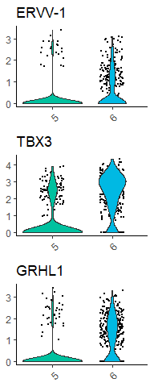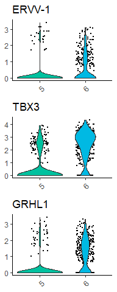
<p class="caption">
Fig5: STB specific genes shared by clusters 5 and 6. Some highly
expressed STB specific genes show (A) higher expression in cluster 5 and
(B) higher expression in cluster 6
</p>

</div>

### 1.11.3 Figure S4

``` r
mesoderm <- c("FOXC1", "TWIST2")
endoderm <- c("AFP", "GATA6")
ectoderm <- c("NES", "PAX6")
multi_dittoPlot(bapd8.integrated, vars = mesoderm, group.by = "new_clusters",
                       vlnplot.lineweight = 0.2, jitter.size = 0.3, ncol = 1, color.panel = color_list)
```


``` r
multi_dittoPlot(bapd8.integrated, vars = endoderm, group.by = "new_clusters",
                       vlnplot.lineweight = 0.2, jitter.size = 0.3, ncol = 1, color.panel = color_list)
```


``` r
multi_dittoPlot(bapd8.integrated, vars = ectoderm, group.by = "new_clusters",
                       vlnplot.lineweight = 0.2, jitter.size = 0.3, ncol = 1, color.panel = color_list)
```


### 1.11.4 Figure S5

``` r
cpm <- c("CCNB1", "MKI67", "PCNA", "CENPF")
multi_dittoPlot(bapd8.integrated, vars = cpm, group.by = "new_clusters", 
                vlnplot.lineweight = 0.2, jitter.size = 0.3, ncol = 1, color.panel = color_list)
```


``` r
figs6a <- c("TLE4", "PCDH9", "MAML2", "TMSB4Y", "CA3")
figs6b <- c("TAGLN", "TMSB10", "S100A11", "S100A6", "S100A10")
figs6c <- c("ACTB", "ACTG1", "IL32", "MYL6", "TPM1")
multi_dittoPlot(cluster2n3, vars = figs6a, group.by = "new_clusters",
                vlnplot.lineweight = 0.2, jitter.size = 0.3, ncol = 1, color.panel = c(color_list[2:3]))
multi_dittoPlot(cluster2n3, vars = figs6b, group.by = "new_clusters",
                vlnplot.lineweight = 0.2, jitter.size = 0.3, ncol = 1, color.panel = c(color_list[2:3]))
multi_dittoPlot(cluster2n3, vars = figs6c, group.by = "new_clusters",
                vlnplot.lineweight = 0.2, jitter.size = 0.3, ncol = 1, color.panel = c(color_list[2:3]))
```

<div class="figure">

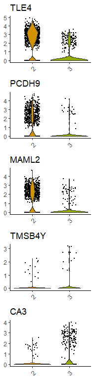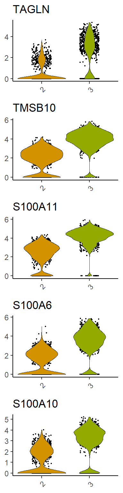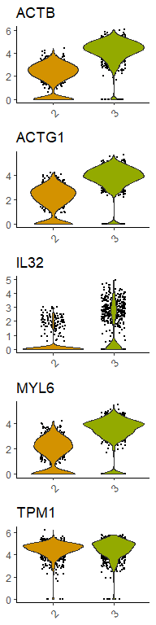
<p class="caption">
Fig S6: Expression levels of genes in Clusters 2 and 3.
</p>

</div>

``` r
figs7 <- c("SLC2A3", "CLIC3", "FN1", "APOE",  "COL3A1", "LUM")
multi_dittoPlot(cluster2356, vars = figs7, group.by = "new_clusters", split.by = "replicate",
                vlnplot.lineweight = 0.2, jitter.size = 0.3, ncol = 1, color.panel = c("#0571b0", "#0571b0", "#0571b0", "#0571b0"))
```


``` r
figs8a <- FeaturePlot(bapd8.integrated, features = "SOX2", min.cutoff = "q9")
figs8b <- VlnPlot(bapd8.integrated, "SOX2", group.by = "new_clusters")
figs8a | figs8b
```


## 1.12 Save Cerebro Image

We will save the results to a `Cerebro` image file.
[Cerebro](https://github.com/romanhaa/Cerebro) allows users to
interactively visualize various parts of single cell transcriptomics
data without requiring bioinformatic expertise. `CerebriApp`, helper R
package, lets us export the `Seurat` analyses to load it into the
`Cerebro`.

``` r
bapd8.integrated <- BuildClusterTree(
  bapd8.integrated,
  dims = 1:30,
  reorder = TRUE,
  reorder.numeric = TRUE
)
#> Reordering identity classes and rebuilding tree
bapd8.integrated[['cluster']] <- factor(
  as.character(bapd8.integrated@meta.data$tree.ident),
  levels = sort(unique(bapd8.integrated@meta.data$tree.ident))
)
bapd8.integrated@meta.data$seurat_clusters <- NULL
bapd8.integrated@meta.data$RNA_snn_res.0.5 <- NULL
bapd8.integrated@meta.data$tree.ident <- NULL
bapd8.integrated <- RunTSNE(
  bapd8.integrated,
  reduction.name = 'tSNE',
  reduction.key = 'tSNE_',
  dims = 1:30,
  dim.embed = 2,
  perplexity = 30,
  seed.use = 100
)
bapd8.integrated <- RunTSNE(
  bapd8.integrated,
  reduction.name = 'tSNE_3D',
  reduction.key = 'tSNE3D_',
  dims = 1:30,
  dim.embed = 3,
  perplexity = 30,
  seed.use = 100
)
bapd8.integrated <- RunUMAP(
  bapd8.integrated,
  reduction.name = 'UMAP_3D',
  reduction.key = 'UMAP3D_',
  dims = 1:30,
  n.components = 3,
  seed.use = 100
)
#> 13:22:54 UMAP embedding parameters a = 0.9922 b = 1.112
#> 13:22:54 Read 5355 rows and found 30 numeric columns
#> 13:22:54 Using Annoy for neighbor search, n_neighbors = 30
#> 13:22:54 Building Annoy index with metric = cosine, n_trees = 50
#> 0%   10   20   30   40   50   60   70   80   90   100%
#> [----|----|----|----|----|----|----|----|----|----|
#> **************************************************|
#> 13:22:55 Writing NN index file to temp file C:\Users\arnstrm\AppData\Local\Temp\RtmpspqJms\file489cda35899
#> 13:22:55 Searching Annoy index using 1 thread, search_k = 3000
#> 13:22:56 Annoy recall = 100%
#> 13:22:56 Commencing smooth kNN distance calibration using 1 thread
#> 13:22:57 Initializing from normalized Laplacian + noise
#> 13:22:57 Commencing optimization for 500 epochs, with 245652 positive edges
#> 13:23:09 Optimization finished
bapd8.integrated@meta.data$sample <- factor('BAPd8_O2Level', levels = 'BAPd8_O2Level')
bapd8.integrated@misc$experiment <- list(
  experiment_name = 'BAPd8_O2Level',
  organism = 'hg',
  date_of_analysis = Sys.Date()
)

bapd8.integrated@misc$technical_info <- list(
  'R' = capture.output(devtools::session_info())
)

bapd8.integrated@misc$parameters <- list(
  gene_nomenclature = 'gene_name',
  discard_genes_expressed_in_fewer_cells_than = 10,
  keep_mitochondrial_genes = TRUE,
  variables_to_regress_out = 'nUMI',
  number_PCs = 30,
  tSNE_perplexity = 30,
  cluster_resolution = 0.5
)

bapd8.integrated@misc$parameters$filtering <- list(
  UMI_min = 100,
  UMI_max = Inf,
  genes_min = 200,
  genes_max = Inf
)

bapd8.integrated <- cerebroApp::addPercentMtRibo(
  bapd8.integrated,
  organism = 'hg',
  gene_nomenclature = 'name'
)
#> [13:23:12] No mitochondrial genes found in data set.
#> [13:23:12] No ribosomal genes found in data set.
bapd8.integrated <- cerebroApp::getMostExpressedGenes(
  bapd8.integrated,
  groups = c('replicate', 'orig.ident', 'cluster' )
)
#> [13:23:12] Get most expressed genes for 2 groups in `replicate`...
#> [13:23:12] Get most expressed genes for 4 groups in `orig.ident`...
#> [13:23:12] Get most expressed genes for 9 groups in `cluster`...
bapd8.integrated <- cerebroApp::getMarkerGenes(
  bapd8.integrated,
  organism = 'hg',
  groups = c('replicate', 'orig.ident', 'cluster' )
)
#> [13:23:59] Get marker genes for 2 groups in `replicate`...
#> Calculating cluster 5pcO2
#> Calculating cluster 20pcO2
#> [13:24:00] Get marker genes for 4 groups in `orig.ident`...
#> Calculating cluster 5pcO2_r1
#> Calculating cluster 5pcO2_r2
#> Calculating cluster 20pcO2_r1
#> Calculating cluster 20pcO2_r2
#> [13:24:01] Get marker genes for 9 groups in `cluster`...
#> Calculating cluster 1
#> Calculating cluster 2
#> Calculating cluster 3
#> Calculating cluster 4
#> Calculating cluster 5
#> Calculating cluster 6
#> Calculating cluster 7
#> Calculating cluster 8
#> Calculating cluster 9
bapd8.integrated <- cerebroApp::getEnrichedPathways(
  bapd8.integrated,
  databases = c("GO_Biological_Process_2018", "GO_Cellular_Component_2018",
                "GO_Molecular_Function_2018", "KEGG_2016", "WikiPathways_2016", "Reactome_2016",
                "Panther_2016", "Human_Gene_Atlas", "Mouse_Gene_Atlas"),
  adj_p_cutoff = 0.05,
  max_terms = 100,
  URL_API = "http://amp.pharm.mssm.edu/Enrichr/enrich"
)
#> [13:24:06] Found 3 groups: replicate, orig.ident, cluster
#> [13:24:06] Get enriched pathways for group `replicate`...
#> Error in scan(file = file, what = what, sep = sep, quote = quote, dec = dec,  : 
#>   line 1 did not have 2 elements
#> Error in scan(file = file, what = what, sep = sep, quote = quote, dec = dec,  : 
#>   line 1 did not have 2 elements
#> Error in scan(file = file, what = what, sep = sep, quote = quote, dec = dec,  : 
#>   line 1 did not have 2 elements
#> Error in scan(file = file, what = what, sep = sep, quote = quote, dec = dec,  : 
#>   line 1 did not have 2 elements
#> Error in scan(file = file, what = what, sep = sep, quote = quote, dec = dec,  : 
#>   line 1 did not have 2 elements
#> Error in scan(file = file, what = what, sep = sep, quote = quote, dec = dec,  : 
#>   line 1 did not have 2 elements
#> [13:24:08] Data returned by Enrichr for subgroup `5pcO2` of group `replicate`, does not appear to be in the right format. Will proceed with next subgroup.
#> [13:24:09] Data returned by Enrichr for subgroup `20pcO2` of group `replicate`, does not appear to be in the right format. Will proceed with next subgroup.
#> [13:24:09] 0 pathways passed the threshold across all group levels and databases for group `replicate`.
#> [13:24:09] Get enriched pathways for group `orig.ident`...
#> Error in scan(file = file, what = what, sep = sep, quote = quote, dec = dec,  : 
#>   line 1 did not have 2 elements
#> Error in scan(file = file, what = what, sep = sep, quote = quote, dec = dec,  : 
#>   line 1 did not have 2 elements
#> Error in scan(file = file, what = what, sep = sep, quote = quote, dec = dec,  : 
#>   line 1 did not have 2 elements
#> Error in scan(file = file, what = what, sep = sep, quote = quote, dec = dec,  : 
#>   line 1 did not have 2 elements
#> Error in scan(file = file, what = what, sep = sep, quote = quote, dec = dec,  : 
#>   line 1 did not have 2 elements
#> Error in scan(file = file, what = what, sep = sep, quote = quote, dec = dec,  : 
#>   line 1 did not have 2 elements
#> Error in scan(file = file, what = what, sep = sep, quote = quote, dec = dec,  : 
#>   line 1 did not have 2 elements
#> Error in scan(file = file, what = what, sep = sep, quote = quote, dec = dec,  : 
#>   line 1 did not have 2 elements
#> Error in scan(file = file, what = what, sep = sep, quote = quote, dec = dec,  : 
#>   line 1 did not have 2 elements
#> Error in scan(file = file, what = what, sep = sep, quote = quote, dec = dec,  : 
#>   line 1 did not have 2 elements
#> Error in scan(file = file, what = what, sep = sep, quote = quote, dec = dec,  : 
#>   line 1 did not have 2 elements
#> Error in scan(file = file, what = what, sep = sep, quote = quote, dec = dec,  : 
#>   line 1 did not have 2 elements
#> [13:24:10] Data returned by Enrichr for subgroup `5pcO2_r1` of group `orig.ident`, does not appear to be in the right format. Will proceed with next subgroup.
#> [13:24:11] Data returned by Enrichr for subgroup `5pcO2_r2` of group `orig.ident`, does not appear to be in the right format. Will proceed with next subgroup.
#> [13:24:12] Data returned by Enrichr for subgroup `20pcO2_r1` of group `orig.ident`, does not appear to be in the right format. Will proceed with next subgroup.
#> [13:24:13] Data returned by Enrichr for subgroup `20pcO2_r2` of group `orig.ident`, does not appear to be in the right format. Will proceed with next subgroup.
#> [13:24:13] 0 pathways passed the threshold across all group levels and databases for group `orig.ident`.
#> [13:24:13] Get enriched pathways for group `cluster`...
#> Error in scan(file = file, what = what, sep = sep, quote = quote, dec = dec,  : 
#>   line 1 did not have 2 elements
#> Error in scan(file = file, what = what, sep = sep, quote = quote, dec = dec,  : 
#>   line 1 did not have 2 elements
#> Error in scan(file = file, what = what, sep = sep, quote = quote, dec = dec,  : 
#>   line 1 did not have 2 elements
#> Error in scan(file = file, what = what, sep = sep, quote = quote, dec = dec,  : 
#>   line 1 did not have 2 elements
#> Error in scan(file = file, what = what, sep = sep, quote = quote, dec = dec,  : 
#>   line 1 did not have 2 elements
#> Error in scan(file = file, what = what, sep = sep, quote = quote, dec = dec,  : 
#>   line 1 did not have 2 elements
#> Error in scan(file = file, what = what, sep = sep, quote = quote, dec = dec,  : 
#>   line 1 did not have 2 elements
#> Error in scan(file = file, what = what, sep = sep, quote = quote, dec = dec,  : 
#>   line 1 did not have 2 elements
#> Error in scan(file = file, what = what, sep = sep, quote = quote, dec = dec,  : 
#>   line 1 did not have 2 elements
#> Error in scan(file = file, what = what, sep = sep, quote = quote, dec = dec,  : 
#>   line 1 did not have 2 elements
#> Error in scan(file = file, what = what, sep = sep, quote = quote, dec = dec,  : 
#>   line 1 did not have 2 elements
#> Error in scan(file = file, what = what, sep = sep, quote = quote, dec = dec,  : 
#>   line 1 did not have 2 elements
#> Error in scan(file = file, what = what, sep = sep, quote = quote, dec = dec,  : 
#>   line 1 did not have 2 elements
#> Error in scan(file = file, what = what, sep = sep, quote = quote, dec = dec,  : 
#>   line 1 did not have 2 elements
#> Error in scan(file = file, what = what, sep = sep, quote = quote, dec = dec,  : 
#>   line 1 did not have 2 elements
#> Error in scan(file = file, what = what, sep = sep, quote = quote, dec = dec,  : 
#>   line 1 did not have 2 elements
#> Error in scan(file = file, what = what, sep = sep, quote = quote, dec = dec,  : 
#>   line 1 did not have 2 elements
#> Error in scan(file = file, what = what, sep = sep, quote = quote, dec = dec,  : 
#>   line 1 did not have 2 elements
#> Error in scan(file = file, what = what, sep = sep, quote = quote, dec = dec,  : 
#>   line 1 did not have 2 elements
#> Error in scan(file = file, what = what, sep = sep, quote = quote, dec = dec,  : 
#>   line 1 did not have 2 elements
#> Error in scan(file = file, what = what, sep = sep, quote = quote, dec = dec,  : 
#>   line 1 did not have 2 elements
#> Error in scan(file = file, what = what, sep = sep, quote = quote, dec = dec,  : 
#>   line 1 did not have 2 elements
#> Error in scan(file = file, what = what, sep = sep, quote = quote, dec = dec,  : 
#>   line 1 did not have 2 elements
#> Error in scan(file = file, what = what, sep = sep, quote = quote, dec = dec,  : 
#>   line 1 did not have 2 elements
#> Error in scan(file = file, what = what, sep = sep, quote = quote, dec = dec,  : 
#>   line 1 did not have 2 elements
#> Error in scan(file = file, what = what, sep = sep, quote = quote, dec = dec,  : 
#>   line 1 did not have 2 elements
#> Error in scan(file = file, what = what, sep = sep, quote = quote, dec = dec,  : 
#>   line 1 did not have 2 elements
#> [13:24:14] Data returned by Enrichr for subgroup `1` of group `cluster`, does not appear to be in the right format. Will proceed with next subgroup.
#> [13:24:16] Data returned by Enrichr for subgroup `2` of group `cluster`, does not appear to be in the right format. Will proceed with next subgroup.
#> [13:24:17] Data returned by Enrichr for subgroup `3` of group `cluster`, does not appear to be in the right format. Will proceed with next subgroup.
#> [13:24:18] Data returned by Enrichr for subgroup `4` of group `cluster`, does not appear to be in the right format. Will proceed with next subgroup.
#> [13:24:19] Data returned by Enrichr for subgroup `5` of group `cluster`, does not appear to be in the right format. Will proceed with next subgroup.
#> [13:24:20] Data returned by Enrichr for subgroup `6` of group `cluster`, does not appear to be in the right format. Will proceed with next subgroup.
#> [13:24:21] Data returned by Enrichr for subgroup `7` of group `cluster`, does not appear to be in the right format. Will proceed with next subgroup.
#> [13:24:22] Data returned by Enrichr for subgroup `8` of group `cluster`, does not appear to be in the right format. Will proceed with next subgroup.
#> [13:24:23] Data returned by Enrichr for subgroup `9` of group `cluster`, does not appear to be in the right format. Will proceed with next subgroup.
#> [13:24:23] 0 pathways passed the threshold across all group levels and databases for group `cluster`.
cerebroApp::exportFromSeurat(
  bapd8.integrated,
  assay = "RNA",
  slot = "data",
  file ="Cerebro_BAPd8_O2Level.crb",
  experiment_name = 'BAPd8_O2Level',
  organism = 'hg',
  groups = c("orig.ident", "replicate", "cluster"),
  cell_cycle = NULL,
  nUMI = 'nCount_RNA',
  nGene = 'nFeature_RNA',
  add_all_meta_data = TRUE,
  use_delayed_array = FALSE,
  verbose = FALSE
)
#> [13:24:23] Start collecting data...
#> [13:24:23] Overview of Cerebro object:
#> 
#> class: Cerebro_v1.3
#> cerebroApp version: 1.3.1
#> experiment name: BAPd8_O2Level
#> organism: hg
#> date of analysis: 2021-03-27
#> date of export: 2021-03-27
#> number of cells: 5,355
#> number of genes: 17,793
#> grouping variables (3): orig.ident, replicate, cluster
#> cell cycle variables (0): 
#> projections (4): umap, tSNE, tSNE_3D, UMAP_3D
#> trees (0): 
#> most expressed genes: replicate, orig.ident, cluster
#> marker genes:
#>   - cerebro_seurat (3): replicate, orig.ident, cluster
#> enriched pathways:
#>   - cerebro_seurat_enrichr (3): replicate, orig.ident, cluster
#> trajectories:
#> extra material:
#> 
#> [13:24:23] Saving Cerebro object to: Cerebro_BAPd8_O2Level.crb
#> [13:24:26] Done!
```

## 1.13 Save RDS file

Finally we will save the entire session data to an external file. This
can be explored again by loading it in R in the future if there is any
need.

``` r
saveRDS(bapd8.integrated, 'bapd8.integrated.rds')
```

## 1.14 Session Info

Complete session information

``` r
sessionInfo()
#> R version 4.0.4 (2021-02-15)
#> Platform: x86_64-w64-mingw32/x64 (64-bit)
#> Running under: Windows 10 x64 (build 19042)
#> 
#> Matrix products: default
#> 
#> locale:
#> [1] LC_COLLATE=English_United States.1252 
#> [2] LC_CTYPE=English_United States.1252   
#> [3] LC_MONETARY=English_United States.1252
#> [4] LC_NUMERIC=C                          
#> [5] LC_TIME=English_United States.1252    
#> 
#> attached base packages:
#>  [1] grid      stats4    parallel  stats     graphics  grDevices utils    
#>  [8] datasets  methods   base     
#> 
#> other attached packages:
#>  [1] enrichR_3.0                 ape_5.4-1                  
#>  [3] cerebroApp_1.3.1            DT_0.17                    
#>  [5] plotly_4.9.3                ggvenn_0.1.8               
#>  [7] scales_1.1.1                ComplexHeatmap_2.6.2       
#>  [9] dittoSeq_1.2.5              ggrepel_0.8.2              
#> [11] calibrate_1.7.7             MASS_7.3-53                
#> [13] enhancedDimPlot_0.0.0.9100  forcats_0.5.1              
#> [15] purrr_0.3.4                 readr_1.4.0                
#> [17] tibble_3.0.4                tidyverse_1.3.0            
#> [19] gprofiler2_0.2.0            TissueEnrich_1.10.0        
#> [21] GSEABase_1.52.1             graph_1.68.0               
#> [23] annotate_1.68.0             XML_3.99-0.6               
#> [25] AnnotationDbi_1.52.0        SummarizedExperiment_1.20.0
#> [27] GenomicRanges_1.42.0        GenomeInfoDb_1.26.4        
#> [29] IRanges_2.24.1              S4Vectors_0.28.1           
#> [31] MatrixGenerics_1.2.1        matrixStats_0.58.0         
#> [33] tidyr_1.1.2                 ensurer_1.1                
#> [35] stringr_1.4.0               dplyr_1.0.5                
#> [37] gridExtra_2.3               multtest_2.46.0            
#> [39] Biobase_2.50.0              BiocGenerics_0.36.0        
#> [41] metap_1.4                   patchwork_1.0.1            
#> [43] cowplot_1.1.0               ggplot2_3.3.2              
#> [45] kableExtra_1.3.4            knitr_1.31                 
#> [47] SeuratWrappers_0.3.0        Seurat_3.2.2               
#> 
#> loaded via a namespace (and not attached):
#>   [1] rappdirs_0.3.1              bit64_4.0.5                
#>   [3] irlba_2.3.3                 multcomp_1.4-16            
#>   [5] DelayedArray_0.16.3         data.table_1.13.2          
#>   [7] rpart_4.1-15                RCurl_1.98-1.3             
#>   [9] generics_0.1.0              callr_3.5.1                
#>  [11] TH.data_1.0-10              usethis_2.0.1              
#>  [13] RSQLite_2.2.4               RANN_2.6.1                 
#>  [15] future_1.20.1               bit_4.0.4                  
#>  [17] mutoss_0.1-12               spatstat.data_2.1-0        
#>  [19] webshot_0.5.2               xml2_1.3.2                 
#>  [21] lubridate_1.7.10            httpuv_1.5.4               
#>  [23] assertthat_0.2.1            viridis_0.5.1              
#>  [25] xfun_0.22                   hms_1.0.0                  
#>  [27] jquerylib_0.1.3             evaluate_0.14              
#>  [29] promises_1.1.1              progress_1.2.2             
#>  [31] fansi_0.4.1                 dbplyr_2.1.0               
#>  [33] readxl_1.3.1                igraph_1.2.6               
#>  [35] DBI_1.1.1                   tmvnsim_1.0-2              
#>  [37] htmlwidgets_1.5.3           paletteer_1.3.0            
#>  [39] ellipsis_0.3.1              RSpectra_0.16-0            
#>  [41] backports_1.2.0             biomaRt_2.46.3             
#>  [43] deldir_0.1-29               vctrs_0.3.6                
#>  [45] SingleCellExperiment_1.12.0 remotes_2.2.0              
#>  [47] Cairo_1.5-12.2              ROCR_1.0-11                
#>  [49] abind_1.4-5                 cachem_1.0.4               
#>  [51] withr_2.3.0                 sctransform_0.3.1          
#>  [53] prettyunits_1.1.1           goftest_1.2-2              
#>  [55] mnormt_2.0.2                svglite_2.0.0              
#>  [57] cluster_2.1.0               lazyeval_0.2.2             
#>  [59] crayon_1.3.4                labeling_0.4.2             
#>  [61] edgeR_3.32.1                pkgconfig_2.0.3            
#>  [63] pkgload_1.1.0               nlme_3.1-152               
#>  [65] devtools_2.3.2              rlang_0.4.10               
#>  [67] globals_0.13.1              lifecycle_1.0.0            
#>  [69] miniUI_0.1.1.1              colourpicker_1.1.0         
#>  [71] sandwich_3.0-0              BiocFileCache_1.14.0       
#>  [73] mathjaxr_1.4-0              modelr_0.1.8               
#>  [75] rsvd_1.0.3                  rprojroot_1.3-2            
#>  [77] cellranger_1.1.0            polyclip_1.10-0            
#>  [79] GSVA_1.38.2                 lmtest_0.9-38              
#>  [81] shinyFiles_0.9.0            Matrix_1.3-2               
#>  [83] zoo_1.8-8                   reprex_1.0.0               
#>  [85] processx_3.4.4              ggridges_0.5.2             
#>  [87] GlobalOptions_0.1.2         pheatmap_1.0.12            
#>  [89] png_0.1-7                   viridisLite_0.3.0          
#>  [91] rjson_0.2.20                bitops_1.0-6               
#>  [93] shinydashboard_0.7.1        KernSmooth_2.23-18         
#>  [95] blob_1.2.1                  shape_1.4.5                
#>  [97] qvalue_2.22.0               parallelly_1.21.0          
#>  [99] memoise_2.0.0               magrittr_1.5               
#> [101] plyr_1.8.6                  ica_1.0-2                  
#> [103] zlibbioc_1.36.0             compiler_4.0.4             
#> [105] RColorBrewer_1.1-2          plotrix_3.8-1              
#> [107] clue_0.3-58                 fitdistrplus_1.1-1         
#> [109] cli_2.1.0                   XVector_0.30.0             
#> [111] listenv_0.8.0               ps_1.4.0                   
#> [113] pbapply_1.4-3               mgcv_1.8-33                
#> [115] tidyselect_1.1.0            stringi_1.5.3              
#> [117] highr_0.8                   yaml_2.2.1                 
#> [119] askpass_1.1                 locfit_1.5-9.4             
#> [121] sass_0.3.1                  tools_4.0.4                
#> [123] future.apply_1.6.0          circlize_0.4.12            
#> [125] rstudioapi_0.11             farver_2.0.3               
#> [127] Rtsne_0.15                  digest_0.6.27              
#> [129] BiocManager_1.30.10         shiny_1.5.0                
#> [131] Rcpp_1.0.5                  broom_0.7.5                
#> [133] later_1.1.0.1               RcppAnnoy_0.0.16           
#> [135] shinyWidgets_0.6.0          httr_1.4.2                 
#> [137] Rdpack_2.1.1                colorspace_1.4-1           
#> [139] rvest_1.0.0                 fs_1.5.0                   
#> [141] tensor_1.5                  reticulate_1.18            
#> [143] splines_4.0.4               uwot_0.1.8                 
#> [145] rematch2_2.1.2              sn_1.6-2                   
#> [147] spatstat.utils_2.1-0        sessioninfo_1.1.1          
#> [149] systemfonts_1.0.1           xtable_1.8-4               
#> [151] jsonlite_1.7.1              spatstat_1.64-1            
#> [153] testthat_3.0.0              R6_2.5.0                   
#> [155] TFisher_0.2.0               pillar_1.4.6               
#> [157] htmltools_0.5.1.1           mime_0.9                   
#> [159] glue_1.4.2                  fastmap_1.0.1              
#> [161] BiocParallel_1.24.1         codetools_0.2-18           
#> [163] pkgbuild_1.1.0              mvtnorm_1.1-1              
#> [165] lattice_0.20-41             bslib_0.2.4                
#> [167] numDeriv_2016.8-1.1         curl_4.3                   
#> [169] leiden_0.3.4                shinyjs_2.0.0              
#> [171] openssl_1.4.3               survival_3.2-7             
#> [173] limma_3.46.0                rmarkdown_2.7              
#> [175] desc_1.2.0                  munsell_0.5.0              
#> [177] GetoptLong_1.0.5            GenomeInfoDbData_1.2.4     
#> [179] shinycssloaders_1.0.0       msigdbr_7.2.1              
#> [181] haven_2.3.1                 reshape2_1.4.4             
#> [183] gtable_0.3.0                rbibutils_2.0
```
